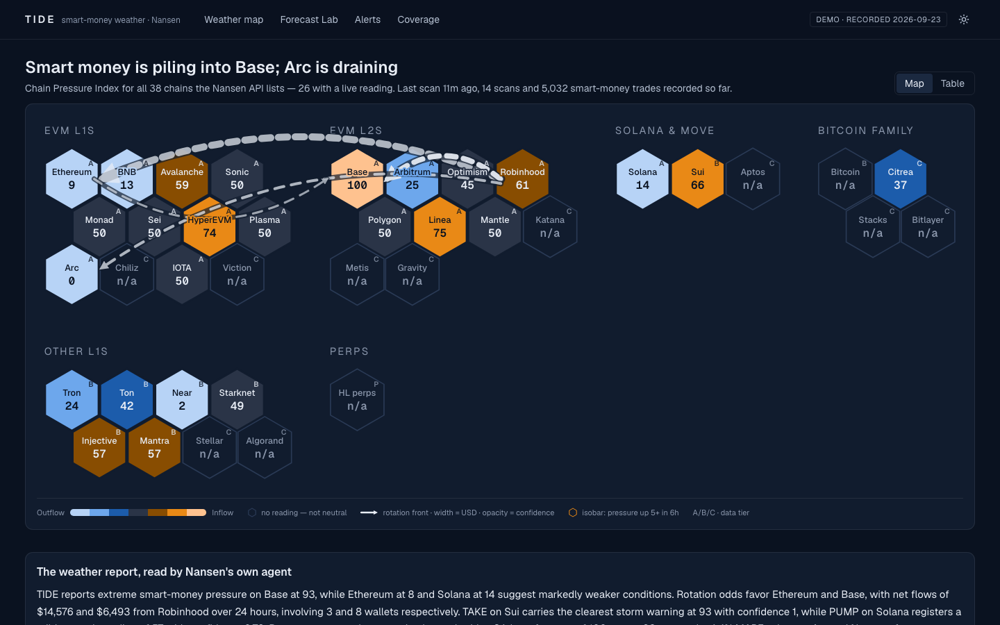
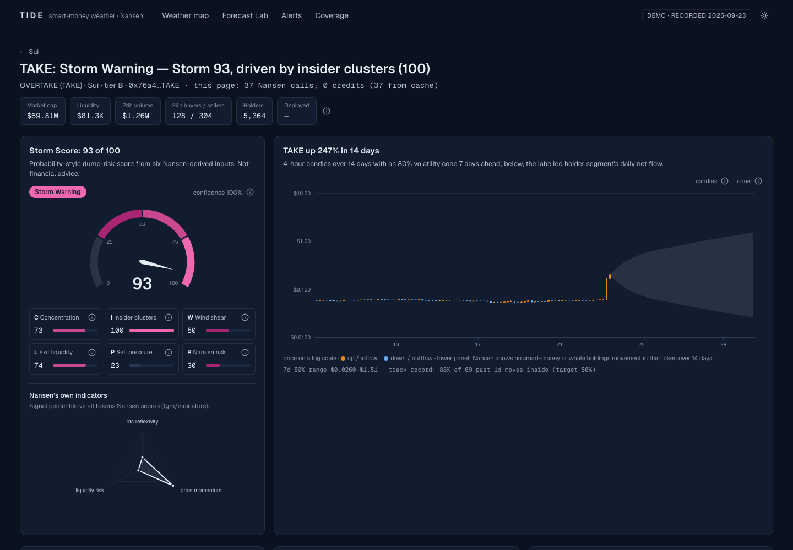
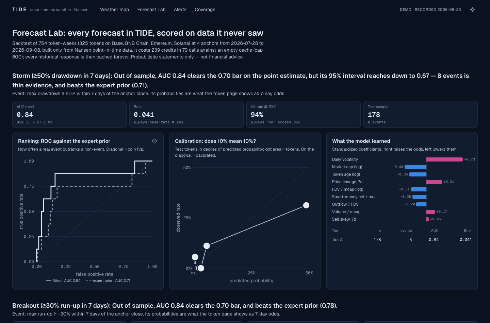
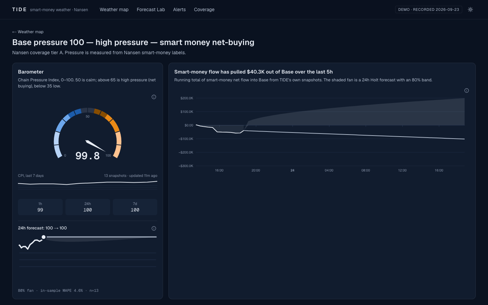
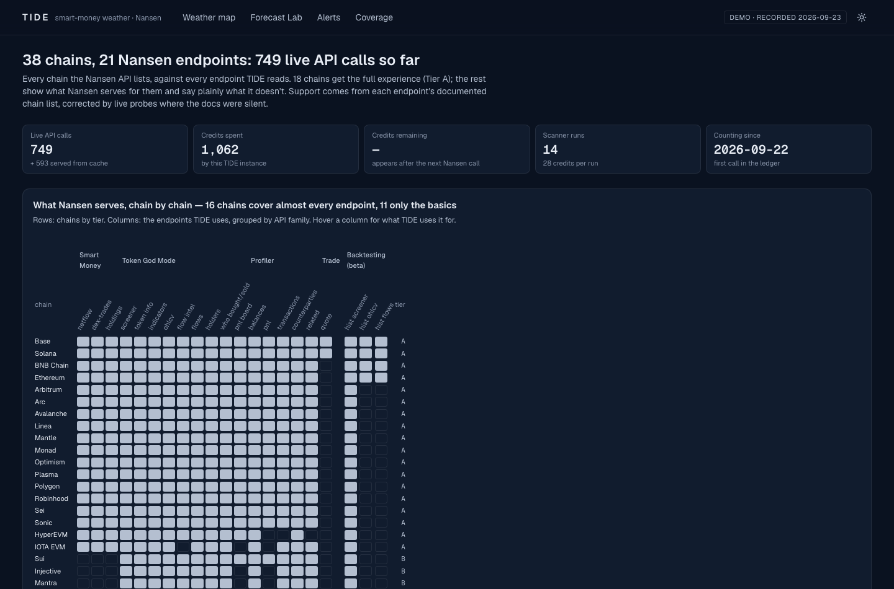
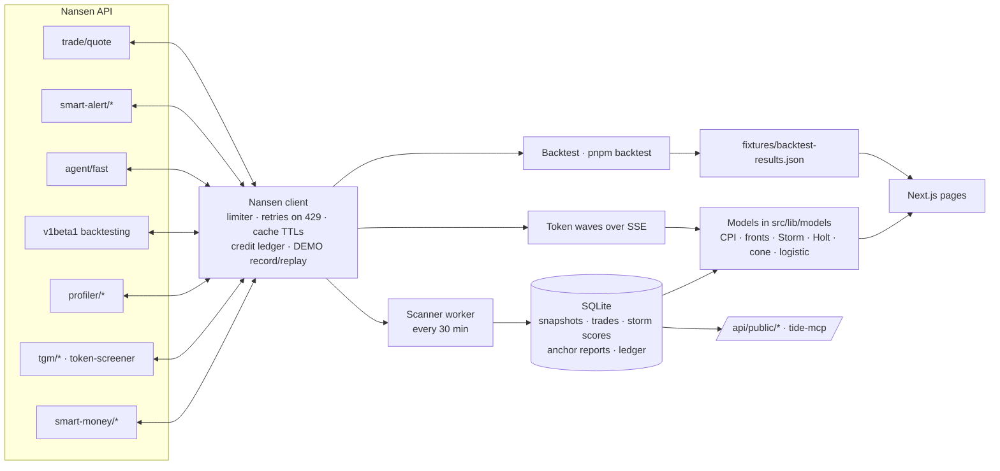

# TIDE — smart-money weather across every chain

**TIDE turns the Nansen API into a live weather map of capital across all 38 chains it lists:** pressure systems where smart money piles in, *fronts* where the same wallets rotate between chains, *storm warnings* on tokens likely to dump, and forecasts that publish their own accuracy. An AI anchor built on Nansen's own agent reads the forecast, and storm warnings become Nansen Smart Alerts that keep watching after the tab closes.



- **The only data source is the Nansen API.** No RPC, no price feeds, no explorers. Even the narration is Nansen's `agent/fast`. A CI guard (`pnpm assert-nansen-only`) fails if any other host appears in `src/`.
- **Every number traces to a Nansen call.** Tap any ⓘ to see the formula, its inputs and the exact request (with its cache key).
- **Every chain is handled.** A capability registry built from each endpoint's documented chain list, corrected by live probes, decides what each chain can show. Unsupported modules say *"Not available on {chain} in Nansen API"*; they don't disappear.
- **No forecast without its track record.** The Forecast Lab scores every model on data it never saw, and each forecast in the app shows that record next to it.

**For the Nansen team:** [Nansen through TIDE](docs/nansen-audit/index.html) is a product and API audit with seven working ideas for app.nansen.ai and nine API fixes, with screenshots from the public view.

Built for the Nansen Meridian Buildathon. Probabilistic readings only; not financial advice. TIDE never signs or executes a trade.

---

## Quick start (under 10 minutes)

```bash
git clone <this repo> tide && cd tide
cp .env.example .env        # paste NANSEN_API_KEY, or set DEMO_MODE=1 to run with no key
pnpm i && pnpm dev          # http://localhost:3000
```

With a key, start the worker in a second terminal. It runs the scanner, which builds TIDE's own time series (the map, fronts and forecasts), plus storm sweeps and any queued backtest, from a job queue in the same SQLite file:

```bash
pnpm worker                 # scan now if due, then every SCAN_INTERVAL_MIN (30) minutes
pnpm jobs                   # queue health and recent jobs
pnpm jobs enqueue backtest  # run the Forecast Lab backtest (never above BACKTEST_CREDIT_CAP)
```

Or run both with Docker: `docker compose up` (web on :3000, worker as a second container sharing the SQLite volume).

**No key? `DEMO_MODE=1`.** Every Nansen response TIDE used while it was built is recorded in `fixtures/`, including the scanner's history (`fixtures/scan-history.json`). In demo mode an empty database imports that history, with its clock moved to now, so the map, fronts, forecasts, storm ticker, token and wallet pages, Lab and Coverage all work without a key or credits. The header badge says it's a replay and when it was recorded. `pnpm dev:demo` runs a keyless demo on :3300 next to a live dev server.

Requirements: Node ≥ 22.13 and pnpm (via `corepack enable`).

## What's in it

| Screen | What it shows |
| --- | --- |
| **Alpha** `/alpha` | What to look at across every chain the scanner reads: tokens scored from named reasons (net buying, persistence, acceleration, smart-money share, liquidity, extended moves, Storm), each listed next to the score. Built from the scanner's own history, so a view costs no credits. |
| **Weather map** `/` | A live pulse band (chains live, top inflow and outflow, rotation fronts, storm warnings), then all 38 chains as hex tiles colored by the Chain Pressure Index (blue = smart money net selling, amber = net buying, outline = no reading), with rotation-front arcs you can open to see the wallets behind them. Also a 24h forecast strip, the storm warnings ticker, and the AI anchor's weather report. |
| **Chain** `/chain/[chain]` | A hero with the pressure ring and the chain's rank among every chain Nansen ranks. A **market grid** of its 96 most-traded tokens coloured by the day's move, and a chain-rank panel. Barometer with a 7-day trend and forecast. A tide chart (cumulative smart-money flow from TIDE's own snapshots, with a Holt forecast fan). Top inflow/outflow tokens, a sector treemap, growth against every chain (slope chart from `chains/chain-rank`) and the smart-money trade tape. |
| **Token** `/token/[chain]/[address]` | Streams in waves over SSE, under a hero (price, trend, market facts, buy/sell split, Storm ring) and view tabs: Overview, Flow, Holders, Leverage, Terminal, All. New visuals: a rotating **holder constellation** (top holders linked by shared funders, related wallets and transfers), cohort flow bars, and a **liquidation ladder** from Hyperliquid perp positions. **Terminal** ([M2 note](docs/modules/M2.md)): live DEX tape with transaction drill-down, whale-transfer river with anomalies, social pulse, Jupiter DCA ladders, a Hyperliquid perp tide gauge and the PnL leaderboard (key owner and members), news on request, and Storm v2 candidates. Above it: candles with a volatility cone and its track record, the **wind rose** (net flow by wallet segment × time window), the Storm Score dial with six sub-scores and Nansen's indicator radar, 7-day storm and breakout odds, holders (Lorenz curve, labels), top buyers vs sellers, and an **insider cluster graph** built from first-funder and related-wallets data. Also "Ask the anchor", "Set storm alert" and "Ride the tide". |
| **Search** ⌘K (every page) | One box for tokens, contract addresses, Nansen entities, chains, sectors and wallet addresses of every family Nansen profiles (EVM, Solana, Bitcoin, Sui, TON, Tron, NEAR…); keyboard first. [M1 note](docs/modules/M1.md) |
| **Entity** `/entity/[name]` | A Nansen entity (exchange, fund, market maker) as one subject: aggregated balances, 30-day trend of its top holdings, realized PnL, counterparties by entity. |
| **Sectors** `/sectors` | Sector weather: pressure per Nansen sector (built like the CPI), with 7-day sparklines and the top tokens flowing in and out. |
| **Perps** `/perps` | Hyperliquid through the Perp Pressure Index: a reading per coin from taker flow, funding and (for the key owner) smart money's long/short book, scored like the CPI against each coin's own history. A pressure grid, a crowding map where the crowd and smart money disagree, per-coin liquidation ladders and trade tapes, and, privately, the trader leaderboard with copy-trade candidate scores. The venue's reading also colours the map's Hyperliquid tile. [M5 note](docs/modules/M5.md) |
| **Predictions** `/predict` | Polymarket through Nansen: category weather (today against each category's own pace), a repricing board of open questions, and per-market detail (implied probability, order book, the largest holders per side, big trades), plus a priced check of where holders with a winning record sit against the price. [M6 note](docs/modules/M6.md) |
| **Smart-money desk** `/smart-money` | Private (key owner or a member's own key). A conviction map of what smart money is adding to and trimming, a conviction score weighted by how many top-PnL wallets hold each token, crowded exits, the PnL leaderboard with a private follow list, perp tilt from new Hyperliquid positions, and Jupiter DCAs. [M4 note](docs/modules/M4.md) |
| **Wallet** `/wallet/[address]` | Balances by chain, 30-day PnL, first funder and related wallets, counterparties, recent transactions, and a **migration trail** of the wallet's smart-money trades drawn over the map. |
| **Forecast Lab** `/lab` | Backtest: ROC against the expert prior, calibration deciles, Brier score, AUC with a 95% CI, per-tier results, coefficients, cone calibration, CPI forecast error. |
| **Alerts** `/alerts` | Nansen Smart Alerts from TIDE's signals (storm, follow list, rotation fronts, chain inflow surges, token buying, deployer moves, any wallets), on all three alert types. Each previews the exact request and is created on your account only on your click; toggle, edit and delete. [M7 note](docs/modules/M7.md) |
| **Research agent** `/agent` | Nansen's agent in expert mode (750 credits a question, price confirmed each time, daily cap), with follow-ups and tool chips; answers saved privately. |
| **MCP** `/api/mcp` | TIDE as an MCP server: ten tools for pressure, storms, alpha, perp pressure, prediction weather, sectors, fronts and conviction. Public by default; a personal token acts as your account. |
| **Coverage** `/coverage` | The endpoint ledger (how much of the Nansen API is in use), chains × endpoints heatmap, and live counters of API calls, credits and scanner runs. The instance owner also sees error rates, schema drift, per-key usage, job health and x402 payments. |
| **Account** `/account` | Sign in with a wallet and bring your own Nansen key, or pay per call (x402) from the priced buttons without one. |

| | |
| --- | --- |
|  |  |
|  |  |

## Architecture



- **Next.js 15 App Router**, TypeScript strict, Tailwind v4, ECharts plus hand-built SVG (hex map, wind rose, slope chart, Lorenz, migration trail), TanStack Query, Zod.
- **`src/server/nansen/client.ts`**: every call goes through one function. It applies the token-bucket limiter (sized by `NANSEN_PLAN`), honors `Retry-After` on 429, caches responses in SQLite with per-family TTLs (netflow 10 min, screener 5 min, indicators 6 h, first funder 7 days, historical forever), records credits from `X-Nansen-Credits-*` headers, and records or replays fixtures for DEMO_MODE. The API key stays on the server.
- **Scanner** (`src/worker/scan.ts`): each run snapshots CPI inputs for every pressure chain and the smart-money DEX trades behind rotation fronts. Every 12 h it also sweeps the tokens smart money is dumping hardest into the storm ticker.
- **Models** (`src/lib/models/`) are pure functions with **208 Vitest tests**, including empty and partial inputs.

## The formulas

**Chain Pressure Index (CPI), 0–100.** For chain *c* and window *w* ∈ {1h, 24h, 7d}: `r = NF / max(V, $10K)`, where NF is smart-money net flow and V is volume from the token screener (Tier B chains, with no smart-money labels, use all-trader flow and are only compared with each other). `z` is a robust z-score of *r* (median and 1.4826·MAD, falling back to mean absolute deviation when MAD = 0) against the chain's own trailing history once 8+ snapshots with spread exist, or against peer chains until then. `CPI_w = 50 + 50·tanh(z/2)` and `CPI = 0.2·CPI_1h + 0.5·CPI_24h + 0.3·CPI_7d`. Above 65 is high pressure, below 35 low.

**Rotation fronts.** From smart-money DEX trades, a *sell* is risk → stable/native and a *buy* is the reverse. For each wallet, a sell on chain A is matched to a later buy on chain B within 12 h, each trade used once. `R(A→B) = Σ min(sold, bought)`, net front = `R(A→B) − R(B→A)`, confidence = `1 − exp(−wallets/3)`. Only fronts with ≥ 2 wallets are shown.

**Storm Score (7-day dump risk), 0–100.**
- **C, concentration:** `100·(0.35·HHI_n + 0.25·Gini + 0.25·Top10 + 0.15·(1 − min(K,20)/20))` over the top 100 holders. Exchange, bridge, pool, contract and burn labels are excluded; team and treasury wallets stay in.
- **I, insider clusters:** union-find over the top 25 real holders, joined by a shared first funder (cross-chain), related-wallets, or the deployer from related-wallets "Deployed by". `I = 100·min(1, 1.6·max_cluster_share + 0.02·n_clustered + 0.15·deployer_linked)`.
- **W, wind shear:** `100·sigmoid(8·(fresh_in − sm_out)/mcap)` from `tgm/flow-intelligence`, 1d.
- **L, exit liquidity:** a weighted mean of thin liquidity/mcap, the largest cluster's size against liquidity, and Nansen's liquidity-risk percentile.
- **P, sell pressure:** top-20 sell skew from `who-bought-sold` (7d), plus the share of that selling done by cluster wallets.
- **R:** Nansen's own risk indicators.
- **Composite:** `Storm = 100·sigmoid(Σ β_j·(s_j − 50)/25)` with expert-prior β. A missing input is dropped, the remaining weights are scaled back to the full total, and confidence equals the share of prior weight present. Bands: Clear < 25 ≤ Cloudy < 50 ≤ Storm Watch < 75 ≤ Storm Warning.

**Forecasts.**
- **Pressure:** Holt linear smoothing on each chain's CPI snapshots, α and β chosen by one-step-ahead error, an 80% fan of ±1.28σ, with MAPE shown.
- **Volatility cone:** EWMA σ (λ = 0.94) on log returns, `P·exp(±1.28·σ·√h)` for 1, 3 and 7 days, with a walk-forward coverage record on the token's own history.
- **7-day odds:** logistic models from the Forecast Lab, applied live to the same features the backtest used.

## The backtest (Forecast Lab)

`pnpm backtest` rebuilds features **from Nansen point-in-time data only**. It calls `token-screener/historical` at 4 anchors two weeks apart on Base, BNB Chain, Ethereum and Solana (all traders + smart money), and labels them with batched 1d OHLCV (10 tokens per credit). It prints its credit estimate first and stops before `BACKTEST_CREDIT_CAP`. Against an empty cache it costs **~240 credits in 80 calls**. The results ship in `fixtures/backtest-results.json`, so demo mode shows them.

Trained on the three older anchors, tested on the newest (178 tokens):

| Model | Test AUC [95% CI] | Expert prior AUC | Brier (base-rate Brier) | Events |
| --- | --- | --- | --- | --- |
| Storm: ≥ 50% drawdown in 7 days | **0.84** [0.67–1.00] | 0.71 | 0.041 (0.043) | 8 |
| Breakout: ≥ 30% run-up in 7 days | **0.84** [0.74–0.95] | 0.78 | 0.085 (0.113) | 23 |
| Volatility cone, 80% band | 83% / 84% / 86% of 1 / 3 / 7-day moves inside | | | 754 token-weeks |

The storm model clears the spec's 0.70 bar on its point estimate, but its interval reaches 0.67 because 8 events is thin evidence; the Lab says exactly that. The cone runs slightly wide. The Storm Score keeps its expert weights: its holder and insider inputs have no point-in-time endpoint, so they can't be fitted. The fitted models power the separate 7-day odds instead.

## Nansen endpoints and credit costs

| Feature | Endpoint | Credits |
| --- | --- | --- |
| Chain pressure, storm sweep, 7-day odds | `token-screener` (≤ 5 chains per call) | 1 |
| Rotation fronts, trade tape, migration trails | `smart-money/dex-trades` | 5 |
| Chain token flows and sectors | `smart-money/netflow` | 5 |
| Growth vs peers | `chains/chain-rank` | 1 |
| Token header, exit liquidity, radar | `tgm/token-information`, `tgm/indicators` | 1, 5 |
| Candles, cone, backtest labels | `tgm/token-ohlcv` (batched 10 per call in the backtest) | 1 |
| Wind rose | `tgm/flow-intelligence` × 4 windows | 1 each |
| Segment flow bars | `tgm/flows` | 1 |
| Holders | `tgm/holders` (`premium_labels` always off) | 5 |
| Buyers vs sellers | `tgm/who-bought-sold` BUY + SELL | 1 each |
| Insider clusters | `profiler/address/first-funder`, `profiler/address/related-wallets` | 1, 1 |
| Wallet page | `profiler/address/current-balance`, `pnl-summary`, `transactions`, `counterparties` | 1, 1, 1, 5 |
| Forecast Lab | `v1beta1/token-screener/historical` | 5 |
| AI anchor | `agent/fast` (SSE) | 200 |
| Storm alerts | `smart-alert`, `smart-alert/list`, `/toggle`, `/{id}` | 0 (observed) |
| Ride the tide | `trade/quote` (quote only) | 0 (observed) |

**What things cost:**
- **Scanner run:** 15–35 credits, about 850/day at the default 30 minutes.
- **Token page, first view:** ~60 credits, about 50 of them the insider forensics, which are cached for 7 days. A repeat view costs ~10.
- **Wallet page:** ~10.
- **Anchor report:** 200. Reports are reused for an hour, generated only on a click, and capped by `ANCHOR_MAX_PER_HOUR`.
- **Storm sweep:** ~17 per token, 6 tokens every 12 h.
- **Backtest:** ~240 once.

The token page shows exactly what it cost (calls, credits, cache hits), and `/coverage` keeps the running total.

## Chain coverage

| Tier | Chains | What works |
| --- | --- | --- |
| **A** (18): smart money + TGM + profiler | arbitrum, arc, avalanche, base, bnb, ethereum, hyperevm, iotaevm, linea, mantle, monad, optimism, plasma, polygon, robinhood, sei, sonic, solana | Everything: smart-money pressure, rotation fronts, full token and wallet pages |
| **B** (8): TGM + profiler, no smart money | bitcoin, injective, mantra, near, starknet, sui, ton, tron | All-trader pressure (ranked only against other Tier B chains), token and wallet pages. Forensics on non-EVM chains use related-wallets only. |
| **C** (11): basics only | bitlayer, chiliz, citrea, gravity, katana, metis, viction, algorand, aptos, stacks, stellar | Candles where `token-ohlcv` covers the chain, search, chain rank. Every other module says it's unavailable. |
| **Perp** | hyperliquid | Listed on the map; no spot pressure |

The tiers of the 11 chains the docs don't clearly cover were set by live probes (`pnpm probe`).

## For other agents

- **Public JSON** (no Nansen spend per request): `/api/public/forecast?chain=base`, `/api/public/storm?chain=sui&token=…`, `/api/public/fronts?hours=24`.
- **MCP server:** `packages/tide-mcp` is a dependency-free stdio server with `tide_weather`, `tide_storm_score` and `tide_rotation_fronts`. For your AI assistant:

```bash
mcp add tide -e TIDE_URL=http://localhost:3000 -- node packages/tide-mcp/index.mjs
```

## Checks

```bash
pnpm verify                 # assert-nansen-only + typecheck + 208 unit tests + production build
pnpm e2e                    # Playwright smoke tests (desktop + phone) against DEMO_MODE, no key
```

## Limitations, stated plainly

- **TIDE's own time series starts when its scanner starts.** Forecasts unlock per chain after 12 snapshots (~6 h at the default cadence), and "unusual for this chain" z-scores need 8+ snapshots. Until then CPI compares a chain with its peers and the ⓘ says so.
- **Tier B pressure reads all-trader flow**, because Nansen has no smart-money labels there (checked live). It's a weaker signal, shown separately and never ranked against smart-money chains.
- **Holder statistics use the top 100 holders Nansen returns**, not every holder, so Gini measures inequality among the largest wallets.
- **Insider clusters are evidence, not proof.** A shared gas funder can be an exchange hot wallet or a faucet. First-funder lookups take EVM addresses only.
- **Rotation fronts match wallets on the same address across chains**, which is exact on EVM chains. Solana/EVM links would need first-funder inference, which TIDE labels "inferred" rather than claim.
- **The backtest covers 4 chains and 4 anchors.** Nansen's historical screener returned no rows for the Tier B chains tried. The storm model's 8 test events give a wide interval, as reported above.
- **Stablecoins that slip past Nansen's `include_stablecoins: false`** on some non-EVM chains (for example SBUSDT, USDSUI on Sui) are removed by an explicit symbol list.
- **Storm alert creation and delivery** are built and schema-validated, but this repo's key was only used to *list* alerts. Create one with your own Telegram chat id to see it arrive. Smart Alert credit costs aren't documented; the calls observed cost 0.
- **Docker** files are included, but the images weren't built in this environment (no Docker daemon). `pnpm i && pnpm dev` is the tested path.

---

*Every number is computed from Nansen API responses. Probabilistic readings, not financial advice.*
