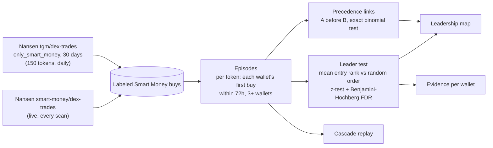
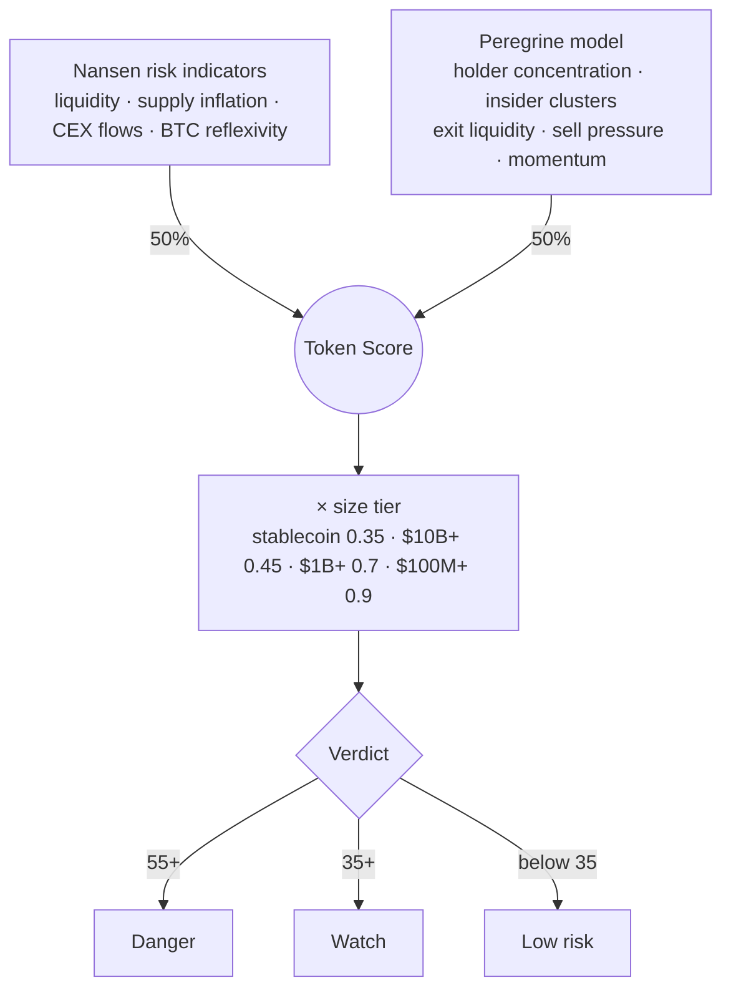
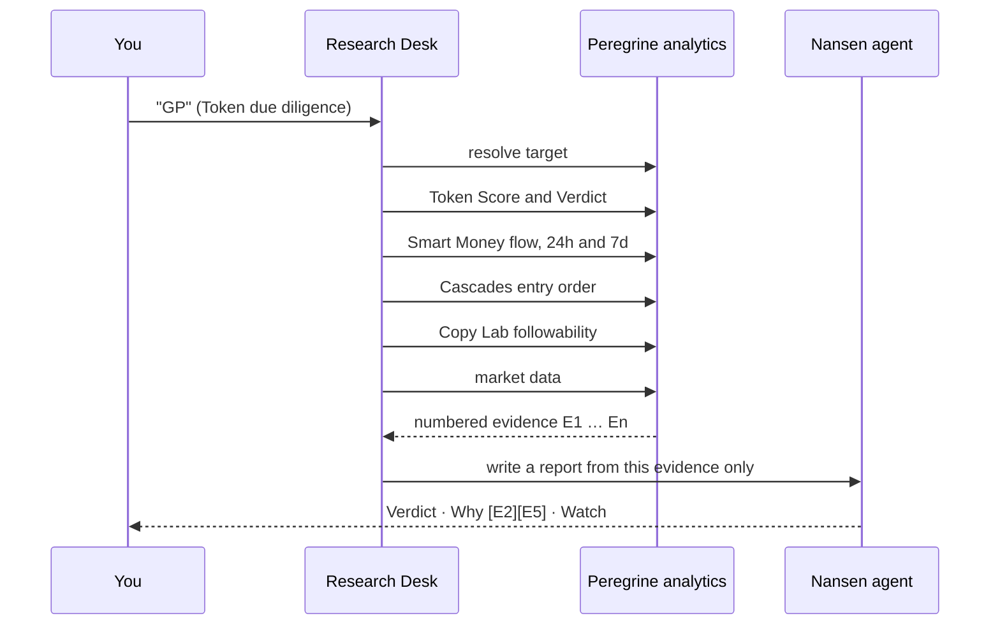
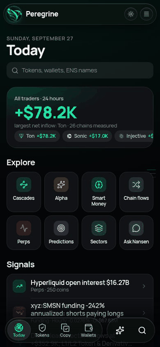
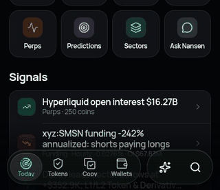
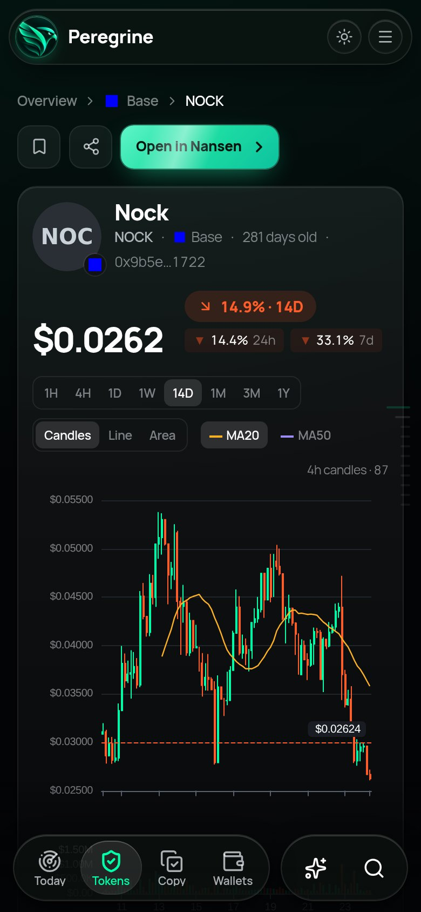
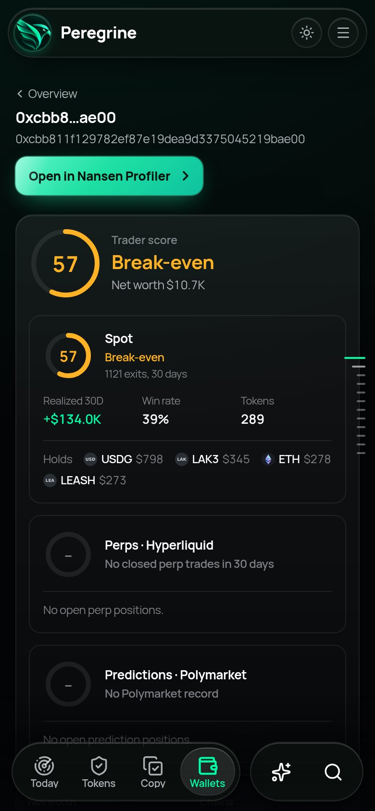
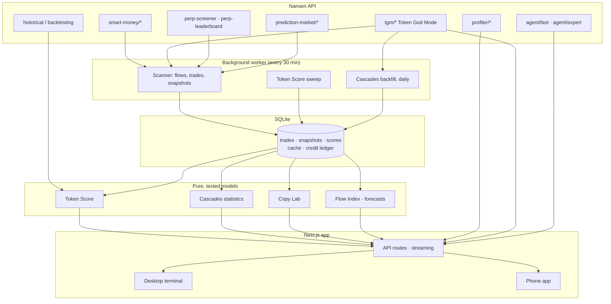

<div align="center">


# Peregrine

**An onchain intelligence terminal built on the Nansen API.**<br/>
It reads Nansen's labeled data, runs its own tested models on it, and shows every answer with the evidence behind it, on desktop and as a phone app.

[](https://peregrine-nansen.up.railway.app)
[](#proof-real-usage-and-tested-models)
[-00FFA7?style=flat-square&labelColor=0d1114)](#how-much-of-the-nansen-api-peregrine-uses)
[](#run-it-yourself)
[](https://nansen.ai/api)

[**Live demo**](https://peregrine-nansen.up.railway.app) · [Proof page](https://peregrine-nansen.up.railway.app/proof) · [Cascades](https://peregrine-nansen.up.railway.app/cascade) · [60-second film](video-production/output/project-showcase-final.mp4)

</div>


<table><tr>
<td width="28%" valign="top"></td>
<td valign="top"><br/><br/>
<b>Ask about anything on screen.</b> On the phone, Ask grows out of the tab bar and reads the page you are on. On desktop (⌘J), <b>Select from page</b> lets you point at a chart, a token or a card; each lands as a chip, and the answer cites the numbers it used.
</td>
</tr></table>

## Contents

1. [What it answers](#what-it-answers)
2. [The main features](#the-main-features)
3. [Smart Money Cascades: how it works](#smart-money-cascades-how-it-works)
4. [Token Score and Verdict](#token-score-and-verdict)
5. [Research Desk](#research-desk)
6. [Proof: real usage and tested models](#proof-real-usage-and-tested-models)
7. [How much of the Nansen API Peregrine uses](#how-much-of-the-nansen-api-peregrine-uses)
8. [Everything else](#everything-else)
9. [Phone app](#phone-app)
10. [Architecture](#architecture)
11. [Data sources and limits](#data-sources-and-limits)
12. [Run it yourself](#run-it-yourself)

## What it answers

| Question | Peregrine feature |
|---|---|
| **What matters on this screen, and why?** | **Ask:** point at any chart, token or card and get an answer that cites its numbers |
| **What is Smart Money buying first?** | **Alpha:** first Smart Money buys, sorted by net bought, one click to the token and the wallet |
| **Who is worth following?** | **Copy Lab:** the most profitable traders in spot, perps and prediction markets, ranked by a copy score |
| **Who moves Smart Money?** | **Cascades:** which labeled wallets enter tokens *before* other Smart Money, tested against chance |
| **Where is the leverage?** | **Perps:** Hyperliquid open interest, funding, the Smart Money book and a liquidation radar per coin |
| **Is this token about to dump?** | **Token Score and Verdict:** 50% Nansen risk indicators, 50% Peregrine's model, plus fitted 7-day dump and breakout odds |
| **What is the full story?** | **Research Desk:** a research plan that gathers numbered evidence and writes a cited report |

## The main features

### Alpha


First Smart Money buys, re-sorted by how much Smart Money has put in. One click opens the token with its Verdict and Token Score; one more opens the wallet that bought it, with its trader score, holdings and allocation. The page also has a market map of tokens by Smart Money flow and price, and alpha scores.

### Copy Lab


Copy Lab ranks the most profitable traders straight from Nansen, with no waiting for history to build up:

| Tab | Source | Ranked by |
|---|---|---|
| **Spot** | Smart Money PnL leaderboard over 7, 30 and 90 days, all chains | Copy score, with KOL, fund and trader tags |
| **Perps** | Hyperliquid leaderboard over 30 and 7 days | Copy score from return, consistency, banked profit and leverage |
| **Predictions** | Winners of the busiest Polymarket markets, then each one's lifetime record | Copy score from lifetime profit, win rate and markets traded |
| **KOLs and cohorts** | Nansen cohort flows: Public Figures, Top PnL traders, Smart Traders, whales, fresh wallets | What each group is buying and selling in 24 hours |

The **copy score** (0 to 100) rewards profit that repeats across windows, is realized rather than on paper, and comes from many tokens or markets. It marks down one lucky trade, bots trading more than 30 times a day, and high leverage (`src/lib/models/copy-score.ts`). A second study, **If you see the trade late**, replays Smart Money buys against Nansen's 15-minute candles to show how much of the edge survives entering 15 minutes, 1 hour or 6 hours late.

### Cascades


Which Smart Money wallets buy *before* other Smart Money, and is that more than chance? The leadership map places each wallet by its average entry rank; the replay drops one token's Smart Money buyers onto a timeline in the order they entered. [How it works ↓](#smart-money-cascades-how-it-works)

### Perps


Hyperliquid through Nansen: open interest, funding extremes, the Smart Money book by coin, and a terminal per coin. The GIF shows BTC's **Liquidation Cascade Radar** re-rendered for Smart Money only, then **Positioning history** under the pointer.

### Token Checker


Type a name, symbol or address on 25 networks (or an ENS name for wallets). Results appear as you type; open one and the Verdict resolves with the Token Score, both of its halves and the reasons behind it.

## Smart Money Cascades: how it works

> **Which labeled Smart Money wallets consistently buy tokens *before* other Smart Money wallets, and who follows whom?**

Nansen's Smart Money trade feed covers the last 24 hours, and tools treat Smart Money wallets as independent actors. Peregrine stores the trades and measures the *order* in which Smart Money wallets enter the same token, then tests it against chance.



1. **Episodes.** For each token, every Smart Money wallet's first buy (≥ $500) within a 72-hour window. A new episode starts after the window closes. Each episode needs at least 3 wallets.
2. **Leaders.** Entry rank is scaled from 0 (first) to 1 (last). If entry order were random, a wallet's mean rank would be 0.5. Each wallet with 3+ episodes gets a z-test, and the results are corrected for testing hundreds of wallets at once (10% false-discovery rate).
3. **Precedence links.** For each pair of wallets that entered 3+ tokens together, an exact binomial test on how often each went first. Entries within a minute count as ties.

**Live result (read from the [Cascades page](https://peregrine-nansen.up.railway.app/cascade) on 28 September 2026):** 8,088 Smart Money buys → **208 episodes** → **305 wallets tested** → 13 wallets enter first at p < 0.05, but **none survives the false-discovery correction**; 11 consistent followers and 9 "enters before" links. The page says so plainly: a strict test that can come back empty is the point. Earlier windows did produce surviving leaders; the result moves as the 30-day window rolls.

**Limits.** Entering first is not causation: two wallets can share a source. Pair links are not corrected for multiple testing. The backfill is capped at 1,000 trades per token, and labels change over time.

## Token Score and Verdict

> **Should I be worried about this token?**

Every token gets a 0 to 100 dump-risk score, **50% Nansen and 50% Peregrine** (`src/lib/models/storm-score.ts`):



- **Nansen half:** Nansen's own low / medium / high risk levels, weighted by indicator.
- **Peregrine half:** a weighted mean of holder concentration, linked insider wallets, exit liquidity, sell pressure from top traders, and fresh-wallet buying against Smart Money selling (hand-set expert weights, `EXPERT_PRIOR_WEIGHTS`).
- **Size tier:** established assets (stablecoins, $10B+ caps, wrapped majors like WETH and WBTC) are scaled down, so a blue chip can't read Danger from onchain patterns alone.

Next to the score, every token page shows **7-day odds** of a 50% dump and a 30% breakout from two fitted logistic models, each with its out-of-sample record (`src/server/token/forecast.ts`). Each token page opens with a **Verdict card**: the level, both halves of the score, up to four reasons that each cite a number, and a one-sentence read from Nansen's agent. **Risk Radar** on the Overview flags Smart Money buying into tokens that score 50 or more.


## Research Desk

> **Everything Peregrine knows about a token or wallet, in one cited report.**



- **Four modes:** Token due diligence, Wallet investigation, Who is leading this token?, and Market brief.
- **A live plan:** every step shows as it runs, and each finding lands as a numbered evidence card with its source.
- **A cited report:** verdict, reasons and what to watch. Tap a citation to highlight its evidence. Saved reports can be reopened.

## Proof: real usage and tested models

Every number in this section comes from files in this repository. `docs/readme/data/` holds the exact exports, and the scripts in `scripts/readme-assets/` redraw every chart from them.


A background worker scans Nansen every 30 minutes and stores what it reads, so a page view costs no credits: **62%** of all data requests in the ledger window were answered from the cache.


| Model | Test | Result | Source |
|---|---|---|---|
| Dump odds (fitted model) | ≥ 50% drawdown within 7 days | **AUC 0.84** (Token Score's hand-set weights: 0.71) | `fixtures/backtest-results.json` |
| Breakout odds (fitted model) | ≥ 30% run-up within 7 days | **AUC 0.84** (hand-set weights: 0.78) | `fixtures/backtest-results.json` |
| Volatility cone | price inside the 80% band after 1 day | **83%** of 754 token-days (target 80%) | `fixtures/backtest-results.json` |
| Flow projections | next Flow Index reading per chain | **7.3%** median error, 27 chains | live, [Proof page](https://peregrine-nansen.up.railway.app/proof), 28 Sep 2026 |

Models are trained on three earlier weeks (576 token-weeks) and tested on the week of 8 September 2026 (178 token-weeks) that they never saw, using Nansen point-in-time data. The dump test has only 8 events, so its AUC interval runs from 0.67 to 1.00. The Proof page states this too.

## How much of the Nansen API Peregrine uses


Peregrine called **74 of the 80 documented Nansen endpoints (92.5%)**, and 8 more that are not in the published docs (account, Hyperliquid trading, points and social posts): **82 endpoints** in total. The 6 unused are Smart Alert management (3), trade execution and bridge status (2), and premium labels (1).

The documented list is `docs/openapi.json` (merged from docs.nansen.ai); the calls are the Proof page ledger (`fixtures/proof-ledger.json`, 22 to 26 September 2026). Paths are compared after removing version prefixes (`v1`, `v1beta1`, `beta`).

<details>
<summary><b>Every endpoint and its call count</b> (88 rows)</summary>

| Family | Endpoint | Calls |
|---|---|--:|
| tgm | `tgm/flow-intelligence` | 574 |
| tgm | `tgm/token-ohlcv` | 331 |
| tgm | `tgm/who-bought-sold` | 268 |
| tgm | `tgm/transfers` | 180 |
| tgm | `tgm/perp-positions` | 162 |
| tgm | `tgm/holders` | 141 |
| tgm | `tgm/token-information` | 103 |
| tgm | `tgm/dex-trades` | 97 |
| tgm | `tgm/flows` | 95 |
| tgm | `tgm/indicators` | 91 |
| tgm | `tgm/pnl-leaderboard` | 56 |
| tgm | `tgm/position-intelligence` | 55 |
| tgm | `tgm/perp-trades` | 31 |
| tgm | `tgm/jup-dca` | 25 |
| tgm | `tgm/historical-token-flow-summary` | 11 |
| tgm | `tgm/historical-top-holders` | 11 |
| tgm | `tgm/historical-who-bought-sold` | 11 |
| tgm | `tgm/perp-pnl-leaderboard` | 9 |
| tgm | `tgm/historical-token-ohlcv` | 7 |
| tgm | `tgm/historical-token-quant-scores` | 7 |
| tgm | `tgm/historical-dex-trades` | 5 |
| tgm | `tgm/historical-pnl-leaderboard` | 5 |
| token-screener | `token-screener` | 1,860 |
| token-screener | `token-screener/historical` | 49 |
| profiler | `profiler/address/related-wallets` | 770 |
| profiler | `profiler/address/first-funder` | 405 |
| profiler | `profiler/address/current-balance` | 243 |
| profiler | `profiler/address/pnl-summary` | 82 |
| profiler | `profiler/address/transactions` | 74 |
| profiler | `profiler/perp-pnl-summary` | 43 |
| profiler | `profiler/perp-positions` | 43 |
| profiler | `profiler/address/counterparties` | 42 |
| profiler | `profiler/address/counterparties/batch` | 17 |
| profiler | `profiler/address/labels` | 16 |
| profiler | `profiler/perp-trades` | 14 |
| profiler | `profiler/address/pnl` | 12 |
| profiler | `profiler/address/historical-balances` | 9 |
| profiler | `profiler/address/historical-token-balances` | 8 |
| profiler | `profiler/address/historical-transactions` | 7 |
| profiler | `profiler/historical-transaction-lookup` | 2 |
| profiler | `profiler/dex-trades` | 1 |
| profiler | `profiler/address/premium-labels` | not used |
| prediction-market | `prediction-market/ohlcv` | 217 |
| prediction-market | `prediction-market/trades-by-market` | 133 |
| prediction-market | `prediction-market/address-summary` | 106 |
| prediction-market | `prediction-market/top-holders` | 53 |
| prediction-market | `prediction-market/categories` | 51 |
| prediction-market | `prediction-market/market-screener` | 48 |
| prediction-market | `prediction-market/event-screener` | 44 |
| prediction-market | `prediction-market/orderbook` | 41 |
| prediction-market | `prediction-market/pnl-by-market` | 21 |
| prediction-market | `prediction-market/pnl-by-address` | 20 |
| prediction-market | `prediction-market/trades-by-address` | 20 |
| prediction-market | `prediction-market/position-detail` | 7 |
| smart-money | `smart-money/dex-trades` | 129 |
| smart-money | `smart-money/perp-trades` | 46 |
| smart-money | `smart-money/netflow` | 31 |
| smart-money | `smart-money/holdings` | 21 |
| smart-money | `smart-money/dcas` | 19 |
| smart-money | `smart-money/pnl-leaderboard` | 16 |
| smart-money | `smart-money/historical-holdings` | 5 |
| smart-money | `smart-money/historical-token-balances` | 3 |
| search | `search/general` | 242 |
| search | `search/entity-name` | 5 |
| search | `search/token-sectors` | 4 |
| perp-screener | `perp-screener` | 75 |
| agent | `agent/fast` | 40 |
| agent | `agent/expert` | 2 |
| chains | `chains/chain-rank` | 30 |
| perp-leaderboard | `perp-leaderboard` | 27 |
| smart-alert | `smart-alert/list` | 10 |
| smart-alert | `smart-alert` | not used |
| smart-alert | `smart-alert/toggle` | not used |
| smart-alert | `smart-alert/{alert_id}` | not used |
| trade | `trade/quote` | 5 |
| trade | `trade/prepare` | 1 |
| trade | `trade/bridge-status` | not used |
| trade | `trade/execute` | not used |
| portfolio | `portfolio/defi-holdings` | 1 |
| transaction-with-token-transfer-lookup | `transaction-with-token-transfer-lookup` | 1 |
| beyond the docs | `account` | 375 |
| beyond the docs | `ra-agent/posts-by-token` | 61 |
| beyond the docs | `points/leaderboard` | 15 |
| beyond the docs | `points/tier` | 2 |
| beyond the docs | `perp/builder-fee` | 1 |
| beyond the docs | `perp/meta` | 1 |
| beyond the docs | `perp/order` | 1 |
| beyond the docs | `ra-agent/posts-by-user` | 1 |

Generated by `python3 scripts/readme-assets/endpoint-table.py`.
</details>


## Everything else

| Page | What it shows |
|---|---|
| **Overview** | Where Smart Money is accumulating and distributing across chains, Risk Radar, Market Pulse signals, Flow Index per chain and 24h projections |
| **Chain flows** | Net flow by chain, and capital rotating chain to chain by the same wallets |
| **Sectors** | Flows by sector and the tokens driving them |
| **Smart Money** | Activity, the wallet network (wallets grouped by their position pattern across markets), and holdings history |
| **Predictions** | Polymarket through Nansen: category heat, repricing, category pages and full market pages |
| **Profiler** | Any wallet or ENS name: a trader score for spot, Hyperliquid and Polymarket, holdings treemap, PnL, counterparties, first funder, Time Machine and its cascade role |
| **Insider clusters** | On token pages: linked top holders as bubbles sized by share of supply, with the shared first funder at the centre |


<table><tr>
<td></td>
<td></td>
</tr><tr>
<td></td>
<td></td>
</tr></table>

## Phone app

The phone version is its own app, not a shrunk desktop:

- **Liquid Glass tab bar:** Today, Tokens, Copy and Wallets, plus Ask and Search. A glass lens glides to the active tab, and the bar shrinks while you scroll.
- **Genie Ask:** the Ask panel grows out of the tab bar button and folds back into it.
- **Large titles and inset grouped lists**, swipeable card rails and a fast-scroll section rail.

<table><tr>
<td width="33%"><br/><sub><b>Genie Ask</b></sub></td>
<td width="33%"><br/><sub><b>Liquid Glass tab bar</b></sub></td>
<td width="33%"><br/><sub><b>Collapsing titles</b></sub></td>
</tr></table>

<table><tr>
<td></td>
<td></td>
<td></td>
<td></td>
</tr></table>

## Architecture



Every Nansen call goes through one function, `callNansen` in `src/server/nansen/client.ts`:


- **Stored, not re-fetched.** Pages read from storage, so history builds up over time and a page view costs no credits.
- **Models are pure functions** with unit tests (`src/lib/models/*`): the Token Score, Cascades statistics, Copy Lab, flow indices and forecasts.
- **Every number has its source.** Charts carry an info popover listing the Nansen calls behind them, and research results cite their evidence.
- **Stack:** Next.js 15, React 19, Tailwind v4, ECharts, SQLite (better-sqlite3), Vitest, Playwright, viem (for ENS).

## Data sources and limits

- **Nansen** is the data source for every analytic, score and model in Peregrine.
- **Other sources, not used for analytics:** token and protocol logos (DexScreener, Jupiter, CoinGecko, CoinCap, Financial Modeling Prep, DefiLlama icons); ENS name resolution (public Ethereum RPCs and ensideas); and, in perps wallet research, Hyperliquid's public info API for full fill history and candles, next to Nansen's positions. `pnpm assert-nansen-only` lists every such host.
- **The GIFs** were recorded from the live app on 27 September 2026 with a frozen browser clock at 60 fps. Waiting for the network is cut out, and on the phone Ask panel the opening animation plays at half speed. Tokens without a logo show a letter badge, as they do in the app.
- **Tests:** `pnpm test` runs 671 unit and integration tests, all passing. The Playwright end-to-end suite has not been updated for the latest screens yet.

## Run it yourself

```bash
pnpm install
cp .env.example .env.local        # add NANSEN_API_KEY
pnpm dev                          # web app on http://localhost:3000
pnpm worker                       # background scanner, in a second terminal
pnpm tsx scripts/cascade-backfill.ts   # optional: fill 30 days of Cascades history now
pnpm test                         # unit and integration tests
pnpm dev:demo                     # demo mode on :3300 from recorded Nansen responses, no key needed
```

**Redraw every figure in this README:**

```bash
pnpm tsx scripts/readme-assets/export-data.ts   # ledger, backtest, coverage, chains → docs/readme/data/
python3 scripts/readme-assets/charts.py         # → docs/readme/charts/ (needs matplotlib)
python3 scripts/readme-assets/endpoint-table.py # the endpoint table above
SHOTS=<capture frames> scripts/readme-assets/gifs.sh   # → docs/readme/gifs/ (needs ffmpeg)
```

**Deploy:** the included `Dockerfile` runs the web app and the worker in one container, with SQLite on a volume at `/data`. The live demo runs this way on Railway.

### Demo in 60 seconds

1. **Overview:** Risk Radar shows Smart Money buying into a high-scoring token.
2. **Ask (⌘J):** select the chart and the token, ask which matters most.
3. **Alpha:** the first Smart Money buys, then the token's Verdict, then the wallet behind it.
4. **Copy Lab:** who is worth following, in spot, perps and predictions.
5. **Cascades:** was that buying led by proven early wallets? Replay who entered first.

---

<div align="center">

<a href="https://nansen.ai"></a>

Built for the **Nansen Meridian Buildathon** on the [Nansen API](https://nansen.ai/api)

</div>
