<div align="center">


# Peregrine

**An onchain intelligence terminal built on the Nansen API.**<br/>
It reads Nansen's labeled data, runs its own tested models on it, and shows every answer with the evidence behind it, on desktop and as a phone app.

### [Submission release: `submission-2026-09-27`](https://github.com/ghostCODERWEB/peregrine-multichain/releases/tag/submission-2026-09-27)

The exact code submitted to the **Nansen Meridian Buildathon**.

[](https://github.com/ghostCODERWEB/peregrine-multichain/releases/tag/submission-2026-09-27)
[](https://peregrine-submission.up.railway.app)
[](#proof-real-usage-and-tested-models)
[-00FFA7?style=flat-square&labelColor=0d1114)](#how-much-of-the-nansen-api-peregrine-uses)
[](#run-it-yourself)
[](#coverage)

[**Submission release**](https://github.com/ghostCODERWEB/peregrine-multichain/releases/tag/submission-2026-09-27) · [Live app (latest build)](https://peregrine-submission.up.railway.app) · [Submitted build, live](https://peregrine-nansen.up.railway.app) · [Proof page](https://peregrine-submission.up.railway.app/proof) · [60-second film](video-production/output/project-showcase-final.mp4) · [What changed since submission](#what-changed-since-the-submission)

</div>

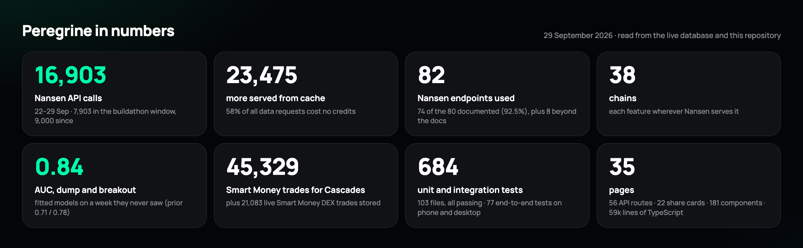

## Contents

1. [What it answers](#what-it-answers)
2. [Six things Nansen doesn't have yet](#six-things-nansen-doesnt-have-yet)
   1. [Copy Lab](#1-copy-lab)
   2. [Ask about anything on screen](#2-ask-about-anything-on-screen)
   3. [Cascades](#3-cascades)
   4. [Flow Index](#4-flow-index)
   5. [Token Verdict](#5-token-verdict)
   6. [Section rail](#6-section-rail)
3. [Upgrades to pages Nansen already has](#upgrades-to-pages-nansen-already-has)
   7. [Holders and insider clusters](#7-holders-and-insider-clusters)
   8. [Perps](#8-perps)
   9. [Alpha](#9-alpha)
   10. [Prediction markets](#10-prediction-markets)
   11. [Sectors](#11-sectors)
   12. [Chain pages](#12-chain-pages)
   13. [Smart Money timeline](#13-smart-money-timeline)
   14. [Profiler](#14-profiler)
4. [And more](#and-more)
   15. [Token Checker](#15-token-checker)
   16. [Research Desk](#16-research-desk)
   17. [History and Time Machine](#17-history-and-time-machine)
   18. [Share previews and SEO](#18-share-previews-and-seo)
   19. [Everything else](#19-everything-else)
5. [Project proof](#project-proof)
   - [Proof page](#proof-page)
   - [On the phone](#on-the-phone)
   - [Under the hood](#under-the-hood)
6. [How the models work](#how-the-models-work)
7. [Proof: real usage and tested models](#proof-real-usage-and-tested-models)
8. [How much of the Nansen API Peregrine uses](#how-much-of-the-nansen-api-peregrine-uses)
9. [Architecture](#architecture)
10. [Project structure](#project-structure)
11. [What changed since the submission](#what-changed-since-the-submission)
12. [Data sources and limits](#data-sources-and-limits)
13. [Run it yourself](#run-it-yourself)
14. [How this README was made](#how-this-readme-was-made)

## What it answers

| Question | Where Peregrine answers it |
|---|---|
| **Who is worth following, and could I actually copy them?** | **Copy Lab**: spot, perp and prediction-market traders on one board, ranked by a copy score |
| **What matters on this screen, and why?** | **Ask about anything on screen**: point at any chart, token or card and ask. The answer cites its numbers |
| **Who moves Smart Money?** | **Cascades**: which labeled wallets enter tokens *before* other Smart Money, tested against chance |
| **Where is money moving, chain by chain?** | **Flow Index**: every chain scored 0–100 against its own history, so a small chain and Ethereum sit side by side |
| **Is this token about to dump?** | **Token Verdict**: 50% Nansen risk indicators, 50% Peregrine's model, one line of reasons, and 7-day dump and breakout odds |
| **Who really holds it?** | **Holders and insider clusters**: the top holders in 3D, grouped by shared funder, relation or deployer |
| **Where is the leverage?** | **Perps**: Hyperliquid open interest, funding, the Smart Money book, a liquidation radar and a pressure score per coin |
| **What is Smart Money buying first?** | **Alpha**: first Smart Money buys, sorted by how much went in |
| **What is the full story?** | **Research Desk**: a research plan that gathers numbered evidence and writes a cited report |
| **Does any of this work?** | **Proof**: every Nansen call counted, and the models tested on a week they never saw |

## Six things Nansen doesn't have yet

These are the features Nansen doesn't offer today, in the order they matter most.

### 1. Copy Lab


A PnL leaderboard tells you who made money. It doesn't tell you whether you could have made that money by following them. Copy Lab answers that.

It ranks **215 traders on one board**: Smart Money spot traders, Hyperliquid perp traders and Polymarket winners. Each one gets a **copy score from 0 to 100**. The score goes up when profit repeats across 7, 30 and 90 days, when it has actually been taken, and when it comes from many different tokens or markets. It goes down for one lucky trade, for bots trading more than 30 times a day, and for heavy leverage. **99 of the 215 score 65 or higher.** Every row also shows what the trader holds right now, so you can act on it.

| Tab | Source | Ranked by |
|---|---|---|
| **All** | Every board below, merged | Copy score |
| **Spot** | Smart Money PnL leaderboard over 7, 30 and 90 days, all chains | Copy score, with KOL, fund and trader tags |
| **Perps** | Hyperliquid leaderboard over 30 and 7 days | Return, consistency, banked profit and leverage |
| **Predictions** | Winners of the busiest Polymarket markets, then each one's lifetime record | Lifetime profit, win rate and markets traded |
| **KOLs and cohorts** | Nansen cohort flows: Public Figures, Top PnL traders, Smart Traders, whales, fresh wallets | What each group is buying and selling in 24 hours |

**If you see the trade late**, a study on the same page, replays Smart Money buys against Nansen's 15-minute candles. It shows how much of the edge is still there if you only notice the trade 15 minutes, an hour or six hours later. The model is in `src/lib/models/copy-score.ts`.

> **What it adds to Nansen:** a copy score next to PnL on every leaderboard.

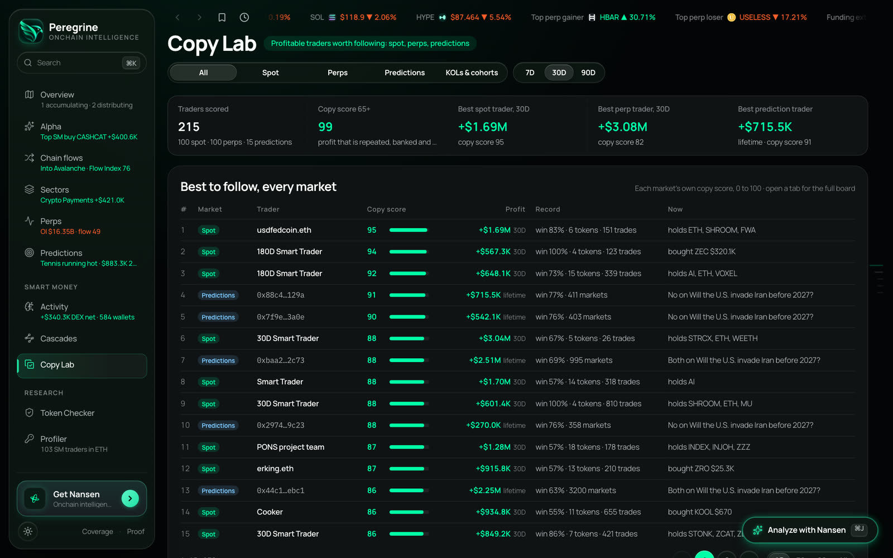

### 2. Ask about anything on screen

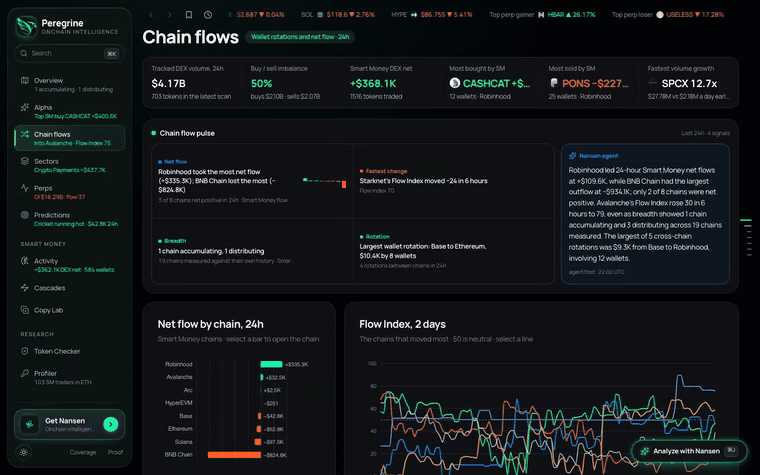

Most AI chat means copying numbers into a text box. Here you just point.

On desktop, press **⌘J** and use **Select from page**. It highlights whatever is under the cursor, whether a chart, a token, a row, a wallet, a market or a card, and each click turns it into a chip in your question. The question goes to Nansen's agent API along with the numbers behind those chips, and the answer quotes the exact numbers it used. **Analyze this page** does the same for the whole screen.

<table><tr>
<td width="30%" valign="top">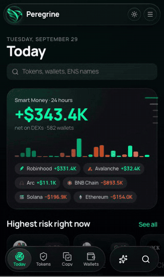</td>
<td valign="top">

**On the phone**, Ask grows out of the tab bar (the "genie" animation) and already knows which page you are looking at. It offers three starting questions built from what is on screen: *What matters most right now? Where is Smart Money rotating, and into what? What is the biggest risk on the board today?*

</td>
</tr></table>

> **What it adds to Nansen:** Nansen AI that can see the screen you are on.

### 3. Cascades


Smart Money labels treat every wallet the same. But some wallets keep buying first, and others keep following them. Cascades finds the leaders, then checks whether the pattern is real or just luck.

For each token, Peregrine takes every Smart Money wallet's first buy within a 72-hour window as one **episode**. Each wallet's average position in the queue is then tested against random order. On the live site:

- 13,016 Smart Money buys form **340 episodes**, and **473 wallets** have enough episodes to test.
- **19 wallets** come in first more often than chance would explain.
- Once the test corrects for checking hundreds of wallets at once, **none of them survive**, and the page says so plainly. An honest empty result beats a list that is always full.
- **17 wallets** consistently arrive late.
- In **16 pairs**, one wallet reliably buys before the other.

The **leadership map** places each wallet by its average entry rank. The **evidence panel** shows its episodes, how often it came first and its typical lead. The **replay** shows who came in first, second and third on any token, and how many hours ahead they were. [How the test works ↓](#smart-money-cascades)

> **What it adds to Nansen:** a badge for wallets that lead Smart Money, and an alert when one of them buys.

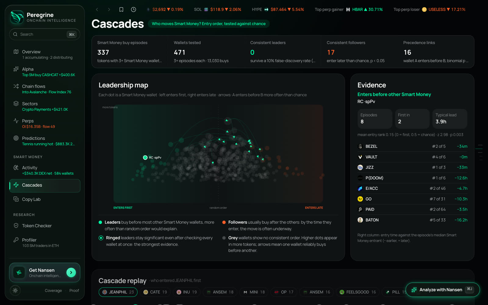

### 4. Flow Index

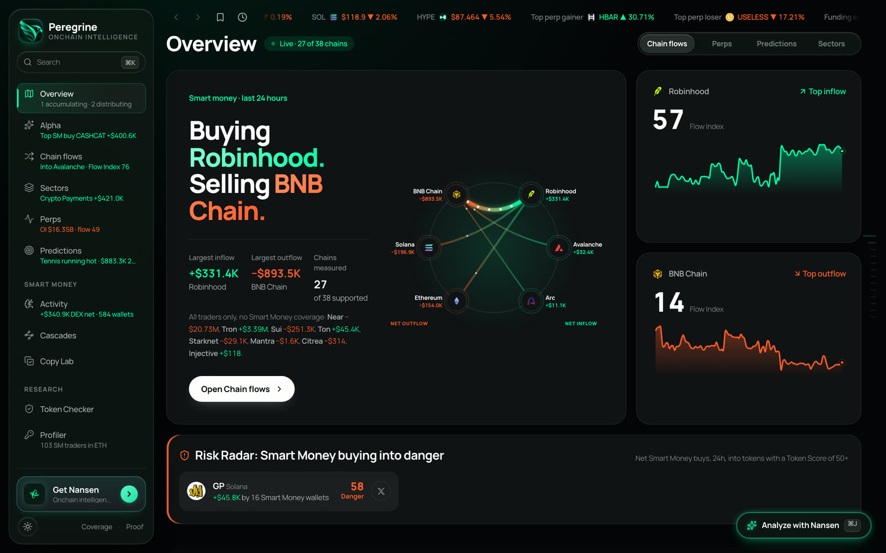

$10M of Smart Money inflow means nothing on Ethereum and a lot on a small chain. So instead of comparing chains with each other, the **Flow Index compares each chain with its own history**.

- **The scale.** Every chain gets a number from 0 to 100. Above 65 means Smart Money is accumulating more than usual; below 35 means it is leaving.
- **The inputs.** Smart Money net flow and volume, scored against the chain's own recent past, so one big whale can't throw it off.
- **One screen.** All 38 chains fit on one screen, and the Overview sums them up in one sentence: "Buying Robinhood. Selling BNB Chain."
- **Forecasts.** Peregrine also forecasts each chain's next reading. The median error on the live Proof page is 7.0%.

The **Overview** shows:
- the net flow map, drawn from sellers to buyers;
- Flow Index cards for the top inflow and outflow;
- **Risk Radar**, which flags Smart Money buying into tokens with a Token Score of 50 or more;
- **Market Pulse**, the day's signals next to a one-paragraph read from Nansen's agent.

Its view tabs switch the whole hero between chain flows, perps, predictions and sectors. When a layer's data is older than its refresh window, it loads the latest by itself and shows the last known board, with its real age, while it waits.

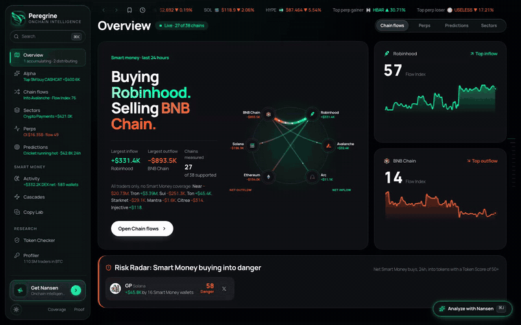

**Chain flows** puts every chain side by side:
- DEX volume, buy/sell imbalance, Smart Money DEX net, the top Smart Money buy and sell, and the fastest-growing chain;
- net flow by chain;
- Flow Index history and the biggest 6-hour moves;
- **rotations**: capital moving chain to chain through the same wallets within 12 hours.


> **What it adds to Nansen:** Nansen already shows Smart Money flows by chain. This scores that flow against each chain's own history, so a small chain and Ethereum can sit side by side.

### 5. Token Verdict

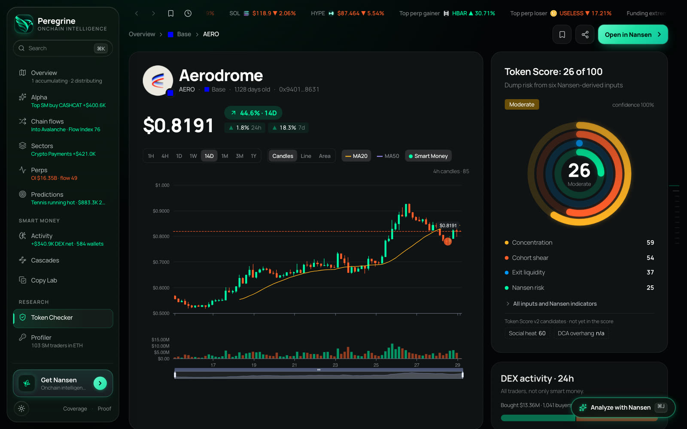

Every token gets a **Token Score from 0 to 100**:
- **Half from Nansen's own risk indicators.**
- **Half from Peregrine's model:** holder concentration, linked insider wallets, exit liquidity, sell pressure and cohort shear, each with its own bar.

On top sits a **one-line verdict with up to four reasons, each backed by a number**, and a one-sentence read from Nansen's agent. Next to it are **7-day odds of a 50% dump and a 30% breakout** from two fitted models. On a week they never saw, both scored an **AUC of 0.84** ([proof ↓](#proof-real-usage-and-tested-models)).

The rest of the token page covers:
- price, as candles, line or area from 1H to 1Y, with MA20, MA50 and a Smart Money overlay;
- DEX activity and a quick read;
- the top buyers and sellers over 7 days;
- **Make a call**: record a view that is graded at its horizon against Nansen candles.

> **What it adds to Nansen:** Nansen already has risk indicators and a distribution score. This turns them into one sentence, with dump and breakout odds, at the top of every token page.

### 6. Section rail


Every page has a thin rail on the right. Hover or drag along it and a label shows which section you will land on and how far down it is ("4/9"); click or let go to jump there. Long pages never feel long. On the phone, the rail is a wider grab strip you drag with your thumb.

> **What it adds to Nansen:** a rail like this on long dashboards.

## Upgrades to pages Nansen already has

Nansen already has pages for most of these. Each one here is an upgrade.

### 7. Holders and insider clusters

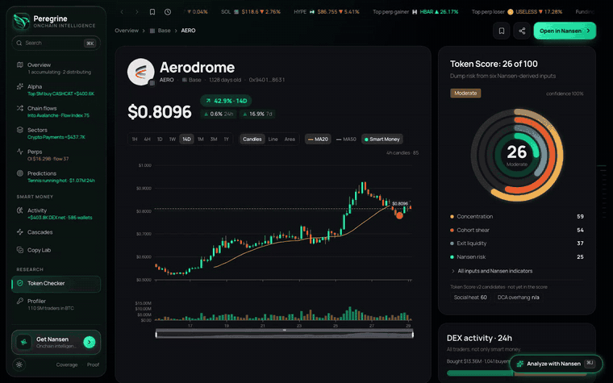

The top holders float in 3D, and you can drag them around. Wallets that share a first funder, a relation or a deployer are grouped into **insider clusters**, each labeled with the share of supply it holds ("8 of the top 25 holders sit in insider clusters"). Hover a wallet to isolate its links. Next to it: what fresh wallets are buying against the top PnL wallets.

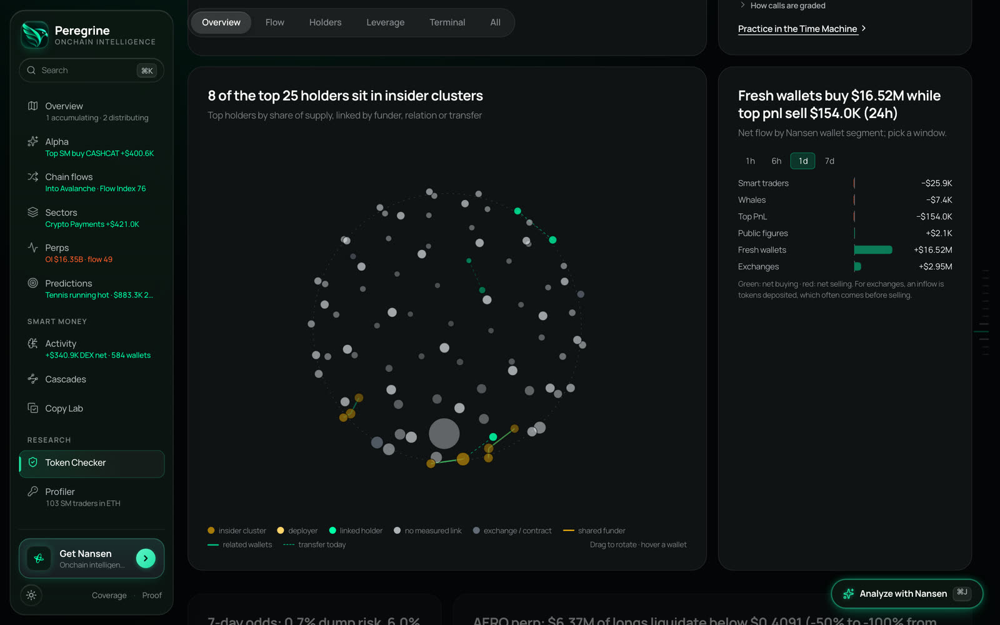

### 8. Perps


Hyperliquid through Nansen:
- open interest and funding;
- the Smart Money book;
- a **crowding map** of funding against Smart Money's long/short skew, which rings the coins where the crowd and Smart Money disagree;
- a **Perp Flow Index for every coin**, a pressure score built the same way as the chains' Flow Index.

Price movers, funding extremes and the Smart Money book by coin page together, so the three cards stay level on every page:

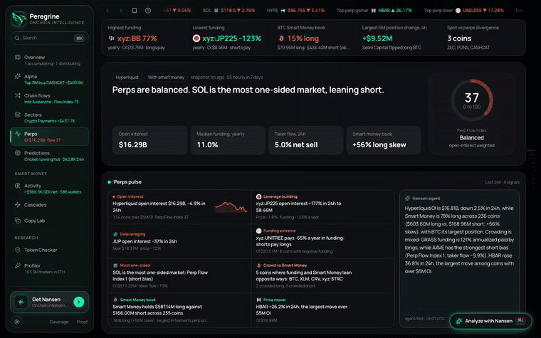

Each coin has its own terminal:
- a **market brief** of statements derived from observed positions;
- **positioning history** you can replay snapshot by snapshot;
- a **Liquidation Cascade Radar** you can filter to Smart Money only;
- holders, the crowd against Smart Money, and funding.

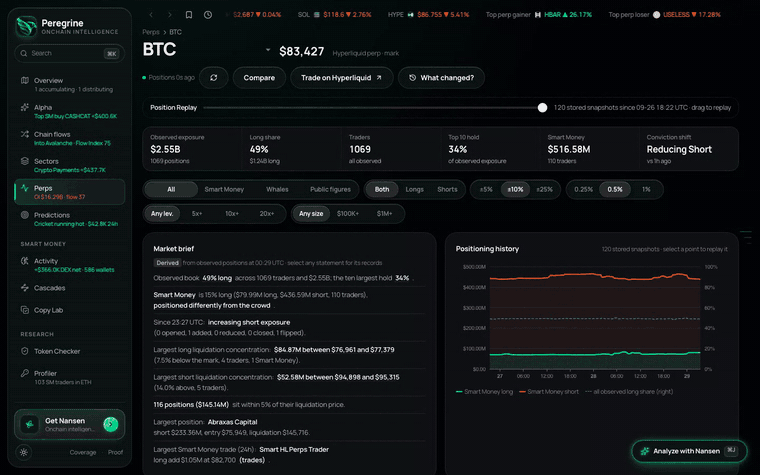

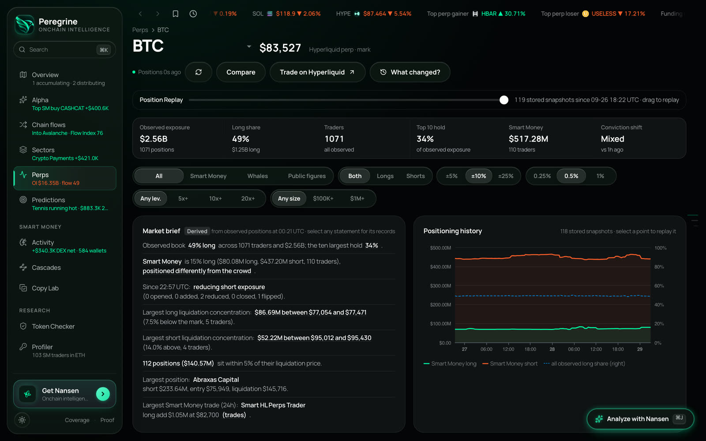

> **What it adds to Nansen:** a pressure score per coin, and an alert when Smart Money buys spot but shorts the same coin on perps (Peregrine already flags these spot-against-perps divergences).

### 9. Alpha

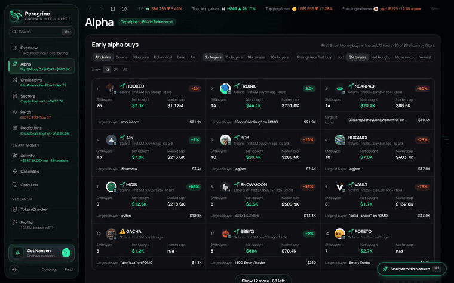

The first tokens Smart Money has started buying, sorted by how much went in. Each card shows the Smart Money buyers, net bought, market cap, the largest buyer and the price change. You can filter by chain and by buyer count. One click opens the token and its verdict; one more opens the wallet that bought it. Below the cards: a **market map** of Smart Money flow against price, alpha scores, and spot-against-perps divergences.

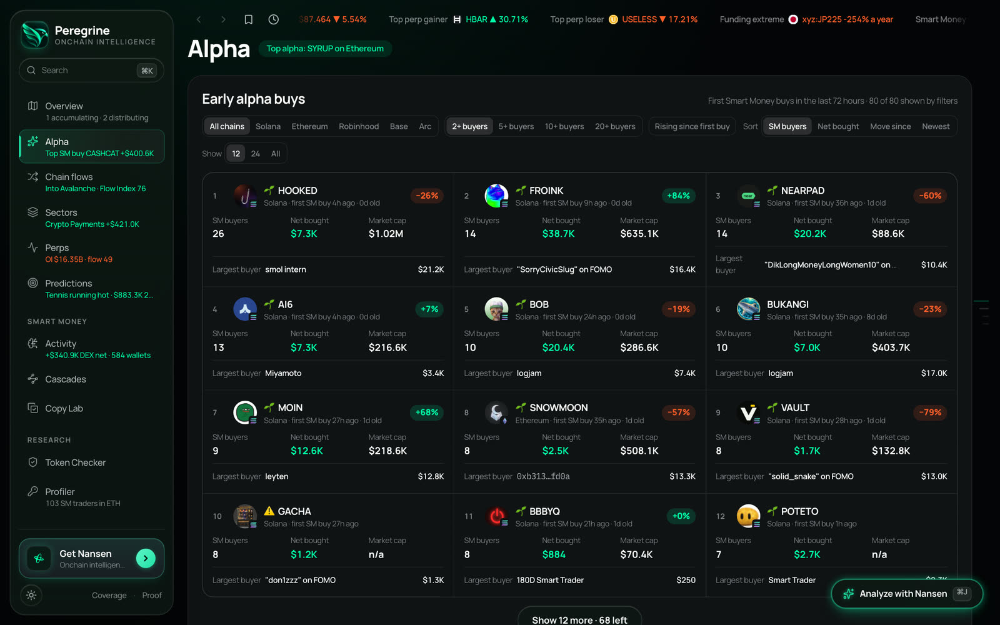

### 10. Prediction markets


Polymarket through Nansen, sorted by what is moving. Each category is measured against its own weekly pace ("Tennis is trading at 6.3× a normal day"), with a 0–100 heat gauge, the biggest repricings, the largest trades and trending markets.

Every market gets a full page:
- price history and the order book;
- top holders valued at today's price;
- whether skilled money agrees with the price.

The best prediction traders also show up in Copy Lab. The Overview has a Predictions view too:

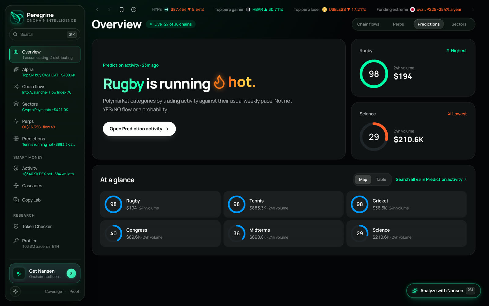

### 11. Sectors


Which themes Smart Money is moving into and out of (DeFi, AI, memecoins, RWAs and more), and how that changed over the week. There is a sector pulse, net flow by sector over 24 hours and over 2 days, and a page per sector with the tokens driving it.

### 12. Chain pages

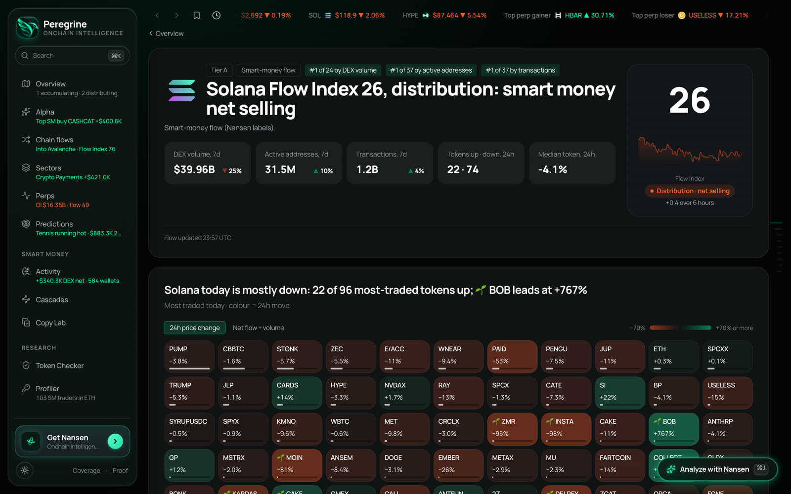

A page for every chain:
- its **Flow Index** and a plain reading ("distribution: smart money net selling");
- a flow gauge with 1h and 7d readings, and a 24h projection;
- where it ranks among 24 chains by DEX volume, active addresses and transactions;
- a **heatmap of its busiest tokens**;
- token flows beside a sector map.

### 13. Smart Money timeline

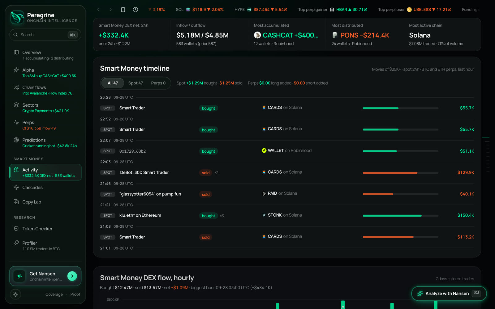

Every large Smart Money move of the day in one feed, spot and perps together, with hourly DEX flow underneath. The same page covers:
- conviction and crowded exits;
- the PnL leaderboard, perp tilt and Jupiter DCAs;
- a **wallet network** that groups wallets by the positions they share across markets.

### 14. Profiler


Open any wallet or ENS name to get:
- **one trader score across spot, perps and prediction markets**, each with its own record;
- holdings, an allocation treemap and PnL attribution;
- counterparties and **who funded it first**;
- a Time Machine view, and the wallet's role in Cascades.

Wallets can be compared side by side and saved to a watchlist.

## And more

### 15. Token Checker


Search by name, symbol or address across **25 networks**, with results as you type. Wallets can be found by ENS name. The home page ranks the **Token Scores of the last 7 days**, split into the Nansen and Peregrine halves with every input as a heat cell, next to the score distribution and the risky tokens Smart Money is buying.


### 16. Research Desk

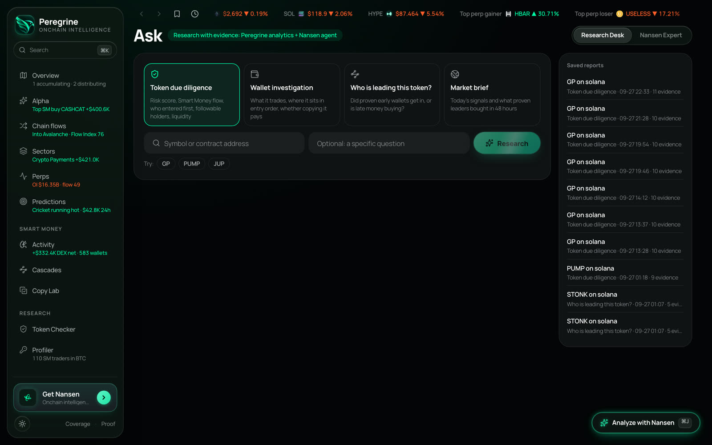

Everything Peregrine knows about a token or wallet, gathered into one cited report:

- **Four modes:** Token due diligence, Wallet investigation, *Who is leading this token?*, and Market brief.
- **A live plan:** every step shows as it runs, and each finding lands as a numbered evidence card with its source.
- **A cited report:** verdict, reasons and what to watch. Tap a citation to highlight its evidence. Saved reports can be reopened.
- **Nansen Expert:** a second tab that asks Nansen's expert agent directly.

### 17. History and Time Machine


**History** compares the market now with 24 hours and 7 days ago, from Peregrine's stored snapshots. It shows Smart Money perp positioning on BTC and ETH, the Flow Index for the chains that moved most, and the largest Flow Index moves and sector swings.

**Time Machine** replays a token from a past moment: make a call with the outcome hidden, then reveal what happened.

### 18. Share previews and SEO

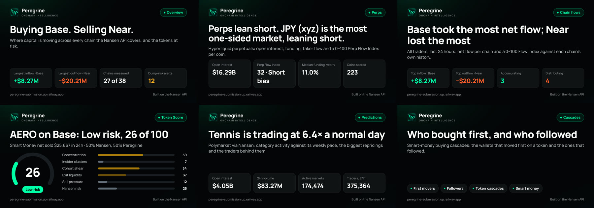

Every section has its own **share card**, 22 in all. Each one is written from the page's own data at the moment of sharing ("Buying Base. Selling Near.", "AERO on Base: Low risk, 26 of 100") and rendered at 1200×630 in the app's typeface.

Every page also has:
- full metadata, a canonical URL and structured data;
- a place in the sitemap, which is built from what is stored now: about 190 URLs across chains, sectors, perps, markets and tokens;
- a robots file and a web app manifest alongside.

### 19. Everything else

| Page or tool | What it does |
|---|---|
| **Desk** | Your calls from token pages, their entry receipts, grades at the horizon, and your "Trader DNA" once calls are graded |
| **Rug check** | A focused rug-risk read for any token |
| **Entity pages** | The wallets Nansen attributes to an entity, their holdings and recent flows |
| **Compare** | Perps side by side, and wallets side by side |
| **Alerts and watchlist** | Alerts on tokens, wallets and chains, and a wallet watchlist |
| **MCP server** (`packages/tide-mcp`) | Peregrine as a tool for other agents: `tide_weather`, `tide_storm_score` and `tide_rotation_fronts` over the Model Context Protocol. It reads Peregrine's own JSON APIs, so an agent asking it spends no Nansen credits |
| **x402 pay-per-call** | Nansen's x402 V2 payment flow, with the payment a wallet signs checked by the server before it is forwarded |
| **Trade** | Nansen trading-API quotes for spot and Hyperliquid, off by default and never run by the test suite |
| **Guided tour** | Five steps for first-time visitors, one tap each |
| **Light theme** | The whole app in a paper theme, with its own chart palette |

## Project proof

Peregrine is more than its features: the build itself is transparent, tested and complete.

### Proof page

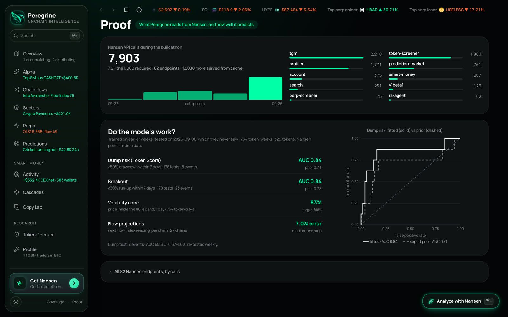

Every Nansen call Peregrine made during the buildathon is logged on the Proof page. It used **74 of the 80 documented endpoints**. The model tests are there too, including their weak spots ([numbers ↓](#proof-real-usage-and-tested-models)). **Coverage** shows which Nansen data sets serve each of the 38 chains, and what each view is built from.

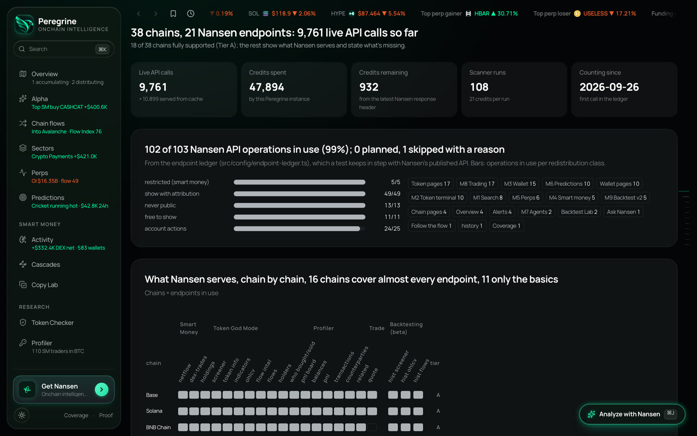

### On the phone

The phone version is its own app, not a squeezed desktop. It has:
- a glass tab bar and large titles;
- swipeable cards and numbered pages;
- a section rail you drag to jump anywhere on the page.

<table><tr>
<td width="33%" valign="top"><br/><sub><b>Liquid Glass tab bar.</b> Today, Tokens, Copy and Wallets, plus Ask and Search. A glass lens glides to the active tab.</sub></td>
<td width="33%" valign="top">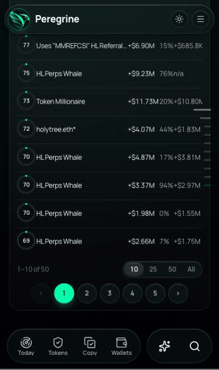<br/><sub><b>Numbered pages.</b> Long lists page in tens, with the same liquid bubble as the tab bar, and the bar stays under your finger.</sub></td>
<td width="33%" valign="top"><br/><sub><b>Scrolling.</b> Large titles collapse, the tab bar shrinks, and the section rail jumps between sections.</sub></td>
</tr></table>

<table><tr>
<td><br/><sub>Today</sub></td>
<td><br/><sub>Tokens</sub></td>
<td><br/><sub>Token</sub></td>
<td><br/><sub>Wallet</sub></td>
</tr><tr>
<td>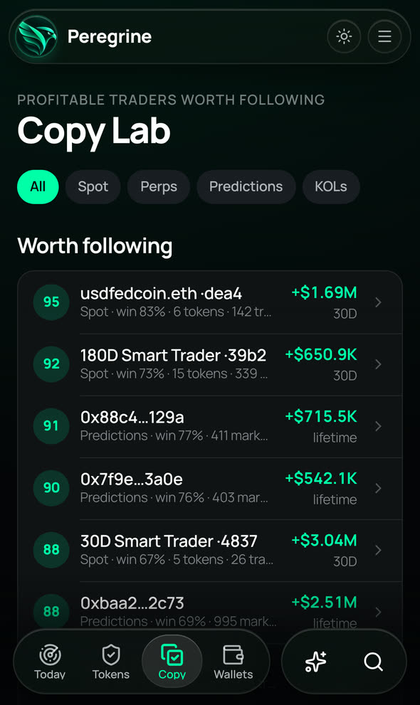<br/><sub>Copy Lab</sub></td>
<td><br/><sub>Perps</sub></td>
<td><br/><sub>Predictions</sub></td>
<td></td>
</tr></table>

### Under the hood

A background worker reads Nansen every 30 minutes and stores what it finds, so most page views cost no credits: **23,475 requests** have been answered from that cache. The app is built with Next.js and SQLite, and **684 unit and integration tests** and **77 end-to-end tests** pass.

Details that don't make a screenshot but show on every visit:

- **No blank waits.** Nansen answers are cached per endpoint. A recently expired answer is served at once and refreshed in the background (stale-while-revalidate, up to 24 hours), so a page never goes empty while it reloads.
- **One failing section never blanks the page.** Every card has its own error boundary. It retries once by itself, then offers *Try again*, while the rest of the page stays up. The Overview ignores a malformed refresh and keeps the last good data. The page-level *Retry* refetches from the server instead of re-rendering the same data.
- **Live changes ease in.** A figure that updates fades from soft to sharp, and new rows settle in instead of snapping.
- **Controls stay under the finger.** Pressing a pager, a date range or a filter never moves the page, even when a shorter page makes the document shorter near its end.
- **Long lists page themselves.** 15 rows per page on desktop and 10 on the phone, with a rows-per-page choice. Later rows render only when used.
- **Keyboard and screen readers.** Every clickable row opens with Enter or Space, focus stays on the pager through a page change, and charts carry text labels.
- **Stale builds heal.** A tab opened before a redeploy reloads once for the new build instead of breaking.
- **Locked down in public.** Every response carries security headers (strict CSP, HSTS, no framing). On the public site:
  - the API answers only this site's own pages;
  - visitors are rate-limited;
  - owner-only tools (keys, MCP, x402, trading, the paid expert agent) are switched off;
  - a per-visitor daily credit cap applies.

## How the models work

### Token Score

Every token gets a 0 to 100 dump-risk score, **50% Nansen and 50% Peregrine** (`src/lib/models/storm-score.ts`):

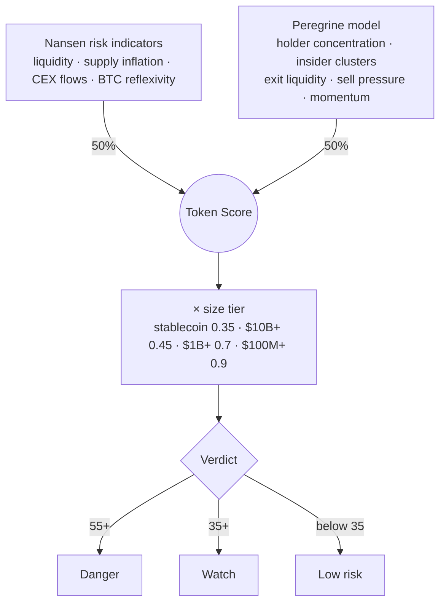
```mermaid
flowchart TB
  N["Nansen risk indicators<br/>liquidity · supply inflation · CEX flows · BTC reflexivity"] -->|50%| S((Token Score))
  P["Peregrine model<br/>holder concentration · insider clusters<br/>exit liquidity · sell pressure · momentum"] -->|50%| S
  S --> T["× size tier<br/>stablecoin 0.35 · $10B+ 0.45 · $1B+ 0.7 · $100M+ 0.9"]
  T --> V{Verdict}
  V -->|55+| D[Danger]
  V -->|35+| W[Watch]
  V -->|below 35| L[Low risk]
```

- **The Nansen half:** Nansen's own low, medium and high risk levels, weighted by indicator.
- **The Peregrine half:** a weighted mean of holder concentration, linked insider wallets, exit liquidity, sell pressure from top traders, and fresh-wallet buying against Smart Money selling. The weights are hand-set expert weights (`EXPERT_PRIOR_WEIGHTS`).
- **Size tier:** established assets (stablecoins, $10B+ caps, wrapped majors like WETH and WBTC) are scaled down, so a blue chip can't read Danger from onchain patterns alone.

Next to the score, each token page shows **7-day odds** of a 50% dump and of a 30% breakout, from two fitted logistic models (`src/server/token/forecast.ts`).

### Smart Money Cascades

Nansen's Smart Money trade feed covers the last 24 hours, and most tools treat Smart Money wallets as independent actors. Peregrine stores the trades (45,329 so far) and measures the *order* in which Smart Money wallets enter the same token, then tests that order against chance.

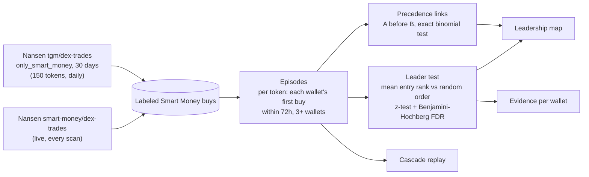
```mermaid
flowchart LR
  A["Nansen smart-money/dex-trades<br/>(live, every scan)"] --> C[(Labeled Smart Money buys)]
  B["Nansen tgm/dex-trades<br/>only_smart_money, 30 days<br/>(150 tokens, daily)"] --> C
  C --> D["Episodes<br/>per token: each wallet's first buy<br/>within 72h, 3+ wallets"]
  D --> E["Leader test<br/>mean entry rank vs random order<br/>z-test + Benjamini-Hochberg FDR"]
  D --> F["Precedence links<br/>A before B, exact binomial test"]
  E --> G[Leadership map]
  F --> G
  D --> H[Cascade replay]
  E --> I[Evidence per wallet]
```

1. **Episodes.** For each token, every Smart Money wallet's first buy (≥ $500) within a 72-hour window. A new episode starts after the window closes. Each episode needs at least 3 wallets.
2. **Leaders.** Entry rank is scaled from 0 (first) to 1 (last). If entry order were random, a wallet's mean rank would be 0.5. Each wallet with 3+ episodes gets a z-test, and the results are corrected for testing hundreds of wallets at once (10% false-discovery rate).
3. **Precedence links.** For each pair of wallets that entered 3+ tokens together, an exact binomial test on how often each went first. Entries within a minute count as ties.

**Limits.** Entering first is not causation: two wallets can share a source. Pair links are not corrected for multiple testing. The backfill is capped at 1,000 trades per token, and labels change over time.

### Research Desk

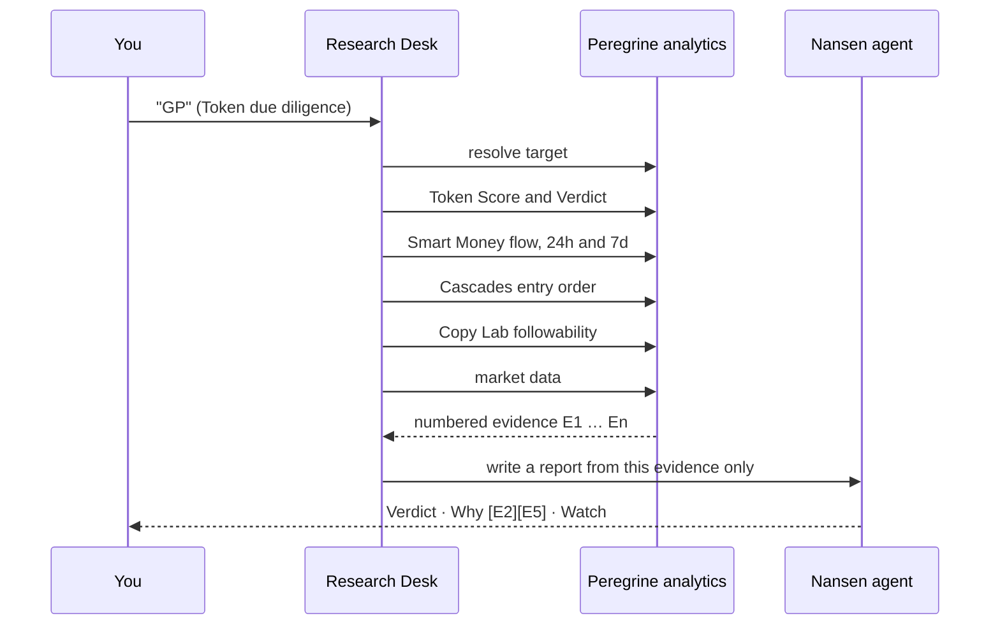
```mermaid
sequenceDiagram
  participant U as You
  participant D as Research Desk
  participant P as Peregrine analytics
  participant N as Nansen agent
  U->>D: "GP" (Token due diligence)
  D->>P: resolve target
  D->>P: Token Score and Verdict
  D->>P: Smart Money flow, 24h and 7d
  D->>P: Cascades entry order
  D->>P: Copy Lab followability
  D->>P: market data
  P-->>D: numbered evidence E1 … En
  D->>N: write a report from this evidence only
  N-->>U: Verdict · Why [E2][E5] · Watch
```

### Other models

All of them are pure functions with unit tests in `src/lib/models/`:

- **Flow Index:** `cpi.ts` for chains and `ppi.ts` for perps.
- **Holt forecasts** with an 80% band: `holt-forecast.ts`.
- **Volatility cone:** `volatility-cone.ts`.
- **Liquidation levels:** `liquidation.ts`.
- **Rotation fronts** between chains: `rotation-fronts.ts` and `inferred-rotations.ts`.
- **Wallet clustering:** `wallet-clustering.ts`.
- **Trader grade:** `trader-grade.ts`.
- **Conviction:** `conviction.ts`.
- **Spot against perps divergence:** `spot-perp.ts`.

## Proof: real usage and tested models

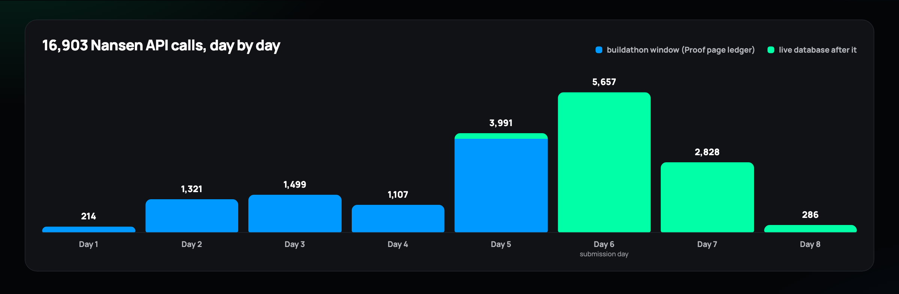

- **16,903 Nansen API calls:**
  - 7,903 in the Proof page's buildathon ledger (`fixtures/proof-ledger.json`).
  - 9,000 in the live database after that window.
- **23,475 more requests were answered from the cache.** A background worker scans Nansen every 30 minutes and stores what it reads, so a page view costs no credits. **58%** of all data requests were free.


| Model | Test | Result | Source |
|---|---|---|---|
| Dump odds (fitted model) | ≥ 50% drawdown within 7 days | **AUC 0.84** (Token Score's hand-set weights: 0.71) | `fixtures/backtest-results.json` |
| Breakout odds (fitted model) | ≥ 30% run-up within 7 days | **AUC 0.84** (hand-set weights: 0.78) | `fixtures/backtest-results.json` |
| Volatility cone | price inside the 80% band after 1 day | **83%** of 754 token-days (target 80%) | `fixtures/backtest-results.json` |
| Flow projections | next Flow Index reading per chain | **7.0%** median error, 27 chains | live, [Proof page](https://peregrine-submission.up.railway.app/proof) |

**How the models were tested:**
- **Training and test data.** Trained on three earlier weeks (576 token-weeks) and tested on a later week (178 token-weeks) that they never saw, using Nansen point-in-time data.
- **Small dump sample.** The dump test has only 8 events, so its AUC interval runs from 0.67 to 1.00. The Proof page says so too.

## How much of the Nansen API Peregrine uses


Peregrine called **74 of the 80 documented Nansen endpoints (92.5%)**, plus 8 more that are not in the published docs (account, Hyperliquid trading, points and social posts): **82 endpoints** in total. The 6 it doesn't use are Smart Alert management (3), trade execution and bridge status (2), and premium labels (1).

- **The documented list** is `docs/openapi.json`, merged from docs.nansen.ai.
- **The calls** are the Proof page ledger (`fixtures/proof-ledger.json`).
- **Matching:** paths are compared after removing version prefixes (`v1`, `v1beta1`, `beta`).

<details>
<summary><b>Every endpoint and its call count in the buildathon window</b> (88 rows)</summary>

| Family | Endpoint | Calls |
|---|---|--:|
| tgm | `tgm/flow-intelligence` | 574 |
| tgm | `tgm/token-ohlcv` | 331 |
| tgm | `tgm/who-bought-sold` | 268 |
| tgm | `tgm/transfers` | 180 |
| tgm | `tgm/perp-positions` | 162 |
| tgm | `tgm/holders` | 141 |
| tgm | `tgm/token-information` | 103 |
| tgm | `tgm/dex-trades` | 97 |
| tgm | `tgm/flows` | 95 |
| tgm | `tgm/indicators` | 91 |
| tgm | `tgm/pnl-leaderboard` | 56 |
| tgm | `tgm/position-intelligence` | 55 |
| tgm | `tgm/perp-trades` | 31 |
| tgm | `tgm/jup-dca` | 25 |
| tgm | `tgm/historical-token-flow-summary` | 11 |
| tgm | `tgm/historical-top-holders` | 11 |
| tgm | `tgm/historical-who-bought-sold` | 11 |
| tgm | `tgm/perp-pnl-leaderboard` | 9 |
| tgm | `tgm/historical-token-ohlcv` | 7 |
| tgm | `tgm/historical-token-quant-scores` | 7 |
| tgm | `tgm/historical-dex-trades` | 5 |
| tgm | `tgm/historical-pnl-leaderboard` | 5 |
| token-screener | `token-screener` | 1,860 |
| token-screener | `token-screener/historical` | 49 |
| profiler | `profiler/address/related-wallets` | 770 |
| profiler | `profiler/address/first-funder` | 405 |
| profiler | `profiler/address/current-balance` | 243 |
| profiler | `profiler/address/pnl-summary` | 82 |
| profiler | `profiler/address/transactions` | 74 |
| profiler | `profiler/perp-pnl-summary` | 43 |
| profiler | `profiler/perp-positions` | 43 |
| profiler | `profiler/address/counterparties` | 42 |
| profiler | `profiler/address/counterparties/batch` | 17 |
| profiler | `profiler/address/labels` | 16 |
| profiler | `profiler/perp-trades` | 14 |
| profiler | `profiler/address/pnl` | 12 |
| profiler | `profiler/address/historical-balances` | 9 |
| profiler | `profiler/address/historical-token-balances` | 8 |
| profiler | `profiler/address/historical-transactions` | 7 |
| profiler | `profiler/historical-transaction-lookup` | 2 |
| profiler | `profiler/dex-trades` | 1 |
| profiler | `profiler/address/premium-labels` | not used |
| prediction-market | `prediction-market/ohlcv` | 217 |
| prediction-market | `prediction-market/trades-by-market` | 133 |
| prediction-market | `prediction-market/address-summary` | 106 |
| prediction-market | `prediction-market/top-holders` | 53 |
| prediction-market | `prediction-market/categories` | 51 |
| prediction-market | `prediction-market/market-screener` | 48 |
| prediction-market | `prediction-market/event-screener` | 44 |
| prediction-market | `prediction-market/orderbook` | 41 |
| prediction-market | `prediction-market/pnl-by-market` | 21 |
| prediction-market | `prediction-market/pnl-by-address` | 20 |
| prediction-market | `prediction-market/trades-by-address` | 20 |
| prediction-market | `prediction-market/position-detail` | 7 |
| smart-money | `smart-money/dex-trades` | 129 |
| smart-money | `smart-money/perp-trades` | 46 |
| smart-money | `smart-money/netflow` | 31 |
| smart-money | `smart-money/holdings` | 21 |
| smart-money | `smart-money/dcas` | 19 |
| smart-money | `smart-money/pnl-leaderboard` | 16 |
| smart-money | `smart-money/historical-holdings` | 5 |
| smart-money | `smart-money/historical-token-balances` | 3 |
| search | `search/general` | 242 |
| search | `search/entity-name` | 5 |
| search | `search/token-sectors` | 4 |
| perp-screener | `perp-screener` | 75 |
| agent | `agent/fast` | 40 |
| agent | `agent/expert` | 2 |
| chains | `chains/chain-rank` | 30 |
| perp-leaderboard | `perp-leaderboard` | 27 |
| smart-alert | `smart-alert/list` | 10 |
| smart-alert | `smart-alert` | not used |
| smart-alert | `smart-alert/toggle` | not used |
| smart-alert | `smart-alert/{alert_id}` | not used |
| trade | `trade/quote` | 5 |
| trade | `trade/prepare` | 1 |
| trade | `trade/bridge-status` | not used |
| trade | `trade/execute` | not used |
| portfolio | `portfolio/defi-holdings` | 1 |
| transaction-with-token-transfer-lookup | `transaction-with-token-transfer-lookup` | 1 |
| beyond the docs | `account` | 375 |
| beyond the docs | `ra-agent/posts-by-token` | 61 |
| beyond the docs | `points/leaderboard` | 15 |
| beyond the docs | `points/tier` | 2 |
| beyond the docs | `perp/builder-fee` | 1 |
| beyond the docs | `perp/meta` | 1 |
| beyond the docs | `perp/order` | 1 |
| beyond the docs | `ra-agent/posts-by-user` | 1 |

Generated by `python3 scripts/readme-assets/endpoint-table.py`.
</details>

### Coverage


## Architecture

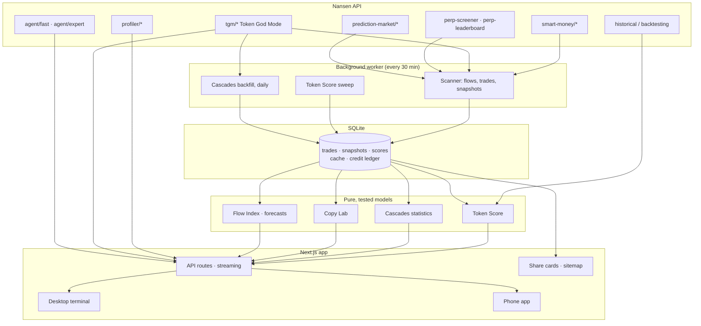
```mermaid
flowchart TB
  subgraph Nansen API
    SM[smart-money/*]
    TGM[tgm/* Token God Mode]
    PR[profiler/*]
    HL[perp-screener · perp-leaderboard]
    PM[prediction-market/*]
    BT[historical / backtesting]
    AG[agent/fast · agent/expert]
  end
  subgraph Worker["Background worker (every 30 min)"]
    SC[Scanner: flows, trades, snapshots]
    SW[Token Score sweep]
    CB[Cascades backfill, daily]
  end
  subgraph Store["SQLite"]
    DB[(trades · snapshots · scores<br/>cache · credit ledger)]
  end
  subgraph Models["Pure, tested models"]
    M1[Token Score]
    M2[Cascades statistics]
    M3[Copy Lab]
    M4[Flow Index · forecasts]
  end
  subgraph App["Next.js app"]
    UI[Desktop terminal]
    PH[Phone app]
    API[API routes · streaming]
    OG[Share cards · sitemap]
  end
  SM & TGM & HL & PM --> SC
  TGM --> CB
  BT --> M1
  SC & SW & CB --> DB
  DB --> M1 & M2 & M3 & M4
  M1 & M2 & M3 & M4 --> API
  PR & TGM --> API
  AG --> API
  API --> UI & PH
  DB --> OG
```

Every Nansen call goes through one function, `callNansen` in `src/server/nansen/client.ts`:

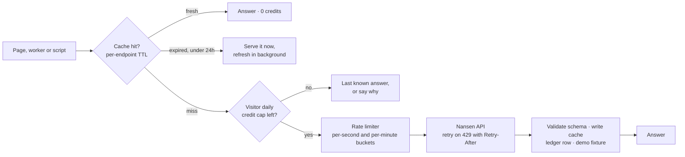
```mermaid
flowchart LR
  R[Page, worker or script] --> C{Cache hit?<br/>per-endpoint TTL}
  C -->|fresh| A[Answer · 0 credits]
  C -->|expired, under 24h| S[Serve it now,<br/>refresh in background]
  C -->|miss| B{Visitor daily<br/>credit cap left?}
  B -->|no| L[Last known answer,<br/>or say why]
  B -->|yes| T[Rate limiter<br/>per-second and per-minute buckets]
  T --> N[Nansen API<br/>retry on 429 with Retry-After]
  N --> V[Validate schema · write cache<br/>ledger row · demo fixture]
  V --> A2[Answer]
```

- **Stored, not re-fetched.** Pages read from storage, so history builds up over time and a page view costs no credits.
- **Models are pure functions** with unit tests (`src/lib/models/*`).
- **Every number has its source.** Charts can carry an info popover that lists the Nansen calls behind them, and research results cite their evidence.
- **Stack:** Next.js 15 (App Router, Turbopack), React 19, Tailwind v4, ECharts, TanStack Query, SQLite (better-sqlite3), zod, viem (ENS), Vitest, Playwright.

## Project structure

The numbers below were counted from the repository:
- **632 files in `src`**: 35 pages, 56 API routes, 22 share-card routes, 181 components, and about 59,000 lines of TypeScript.
- **103 unit and integration test files** with 684 tests.
- **19 end-to-end specs.**

```text
Peregrine/
├── src/
│   ├── app/                          Next.js App Router: every page, API route and share card
│   │   ├── page.tsx                  Overview (desktop) and Today (phone)
│   │   ├── layout.tsx                shell: sidebar, market strip, tab bar, providers, metadata, JSON-LD
│   │   ├── error.tsx                 page-level error screen: Retry refetches from the server
│   │   ├── global-error.tsx          last resort when the layout itself fails
│   │   ├── globals.css               design tokens (dark + paper themes), glass, pager, rail, motion
│   │   ├── opengraph-image.tsx       share card for the Overview (one per section, 22 in all)
│   │   ├── sitemap.ts · robots.ts · manifest.ts
│   │   ├── alpha/                    Alpha: early Smart Money buys, market map
│   │   ├── token/                    Token Checker, token pages ([chain]/[address]) with Verdict
│   │   ├── copy/                     Copy Lab
│   │   ├── cascade/                  Smart Money Cascades
│   │   ├── perps/                    Perps board, [symbol] coin terminal, compare
│   │   ├── predict/                  Predictions, [id] market pages, category/[name]
│   │   ├── flows/                    Chain flows
│   │   ├── chain/[chain]/            one page per chain
│   │   ├── sectors/                  Sectors and [sector] pages
│   │   ├── smart-money/              Smart Money desk
│   │   ├── wallet/                   Wallet Profiler, [address], compare, watchlist
│   │   ├── entity/[name]/            entity wallets and flows
│   │   ├── agent/                    Ask: Research Desk and Nansen Expert
│   │   ├── history/                  what changed in 24h and 7d
│   │   ├── replay/                   Time Machine
│   │   ├── desk/                     your calls and their grades
│   │   ├── rug/                      rug check
│   │   ├── proof/ · coverage/        proof of usage and models · chain coverage
│   │   ├── portfolio/ · trade/ · alerts/ · account/ · lab/
│   │   └── api/                      56 route handlers: weather, token, verdict, perps, predict, cascade,
│   │                                 wallet, search, research, ask, agent, time-machine, replay, desk,
│   │                                 public (JSON for MCP), mcp, x402, trade, auth, health, …
│   ├── components/                   181 React components
│   │   ├── weather/                  Overview: net flow ring, layers, prediction activity, chain table
│   │   ├── analyze/                  Analyze with Nansen dock, pick mode, genie animation
│   │   ├── token/                    Token Score ring, Verdict, candles, insider clusters, make a call
│   │   ├── perps/                    perps board, crowding map, coin terminal, liquidation radar
│   │   ├── chain/ · sectors/ · predict/ · smart-money/ · wallet/ · alpha/ · cascade/ · pulse/
│   │   ├── research/ · agent/ · desk/ · history/ · rug/ · trade/ · x402/ · search/
│   │   ├── mobile/                   the phone app: Today, Tokens, Copy Lab, Wallets
│   │   ├── shell/                    sidebar, market strip, Liquid Glass tab bar, navigation progress
│   │   ├── charts/ · viz/            ECharts wrappers, ranked lists, maps, gauges
│   │   ├── ui/                       shared primitives (segmented control, keyboard activation, …)
│   │   ├── Card.tsx                  the section card; every card has its own error boundary
│   │   ├── SectionBoundary.tsx       per-section error boundary: retries once, then offers Try again
│   │   ├── Pager.tsx                 numbered pages for long tables and lists, with the liquid lens
│   │   ├── LaterBody.tsx             long tables render their later rows only when used
│   │   ├── LiveValues.tsx            figures that change ease in instead of snapping
│   │   ├── SectionRail.tsx           the fast-scroll section rail
│   │   └── GuidedTour.tsx            five-step first-visit tour
│   ├── server/                       server-only code (never shipped to the browser)
│   │   ├── nansen/                   callNansen: cache, stale-while-revalidate, rate limiter,
│   │   │                             credit ledger, demo fixtures, x402, health
│   │   ├── weather/                  scanner, bulletin, layers, chain pages, inferred rotations
│   │   ├── token/                    Token Score sweep, Verdict, forecasts, candles, on-demand reads
│   │   ├── perps/ · predict/ · alpha/ · copy/ · cascade/ · sectors/ · smart-money/ · wallet/
│   │   ├── agents/                   Nansen agent calls: ask, quick briefs, expert, alerts, perps analyst
│   │   ├── research/ · desk/ · history/ · backtest/ · graph/ · portfolio/ · trade/ · search/
│   │   ├── jobs/                     background jobs (scans, sweeps, backfills)
│   │   ├── mcp/                      MCP endpoint
│   │   ├── auth/                     accounts, sessions, API keys (off on the public site)
│   │   ├── seo.ts · og-data.ts       site URL, page metadata, share-card data
│   │   └── insights.ts · pulse.ts    the pulse panels' findings
│   ├── lib/
│   │   ├── models/                   pure, tested models: storm-score, cascade, copy-score, cpi, ppi,
│   │   │                             holt-forecast, volatility-cone, liquidation, logistic, trader-grade,
│   │   │                             wallet-clustering, rotation-fronts, conviction, spot-perp, …
│   │   ├── viz/                      formatting, colour scales, net flow map layout
│   │   ├── og/                       share-card renderer and its fonts
│   │   └── …                         provenance, capabilities, commands, x402, hydration, stale-build
│   ├── worker/                       the background worker (index.ts) and one-off scan (scan.ts)
│   ├── config/                       capability registry, endpoint ledger, external hosts
│   └── middleware.ts                 security headers (strict CSP, HSTS, no framing), public-site guard:
│                                     same-origin API, per-visitor rate limits, owner-only tools off
├── e2e/                              Playwright: 19 specs on desktop and phone; the 3 trading specs skip
│                                     unless pointed at a private trading instance
├── fixtures/                         recorded Nansen responses for demo mode, backtest results,
│                                     the Proof page ledger
├── scripts/                          worker start, backfills, backtest, capability probes,
│   │                                 assert-nansen-only, fixture tools, stress and smoke tests
│   └── readme-assets/                charts, endpoint table, and the capture and GIF pipeline
├── packages/tide-mcp/                MCP server over stdio for other agents
├── docs/
│   ├── readme/                       every image and GIF in this README
│   ├── openapi.json                  the documented Nansen API, merged from docs.nansen.ai
│   ├── nansen-audit/ · design/       API audit notes and design references
│   └── DECISION_LOG.md · SCORECARD.md · api-validation.md · nansen-quirks-v1.md
├── public/                           brand marks and 126 token and protocol logos
├── video-production/                 the 60-second film: plan, capture and render scripts, output
├── Dockerfile · docker-compose.yml   one container: web app + worker, SQLite on a volume at /data
└── package.json                      pnpm scripts (see below)
```

## What changed since the submission

The submitted code is the [`submission-2026-09-27` release](https://github.com/ghostCODERWEB/peregrine-multichain/releases/tag/submission-2026-09-27). This branch continues from it ([full diff](https://github.com/ghostCODERWEB/peregrine-multichain/compare/submission-2026-09-27...ui-qa-fixes)):

- **Paging everywhere.** Long tables and lists have numbered pages, a rows-per-page choice and a liquid page bubble. The Perps books page together. Later rows render only when used.
- **Reliability.** Every section has its own error boundary. Expired cache answers are served at once and refreshed in the background. Prediction activity fills itself in. Retry refetches from the server.
- **Motion and feel.** Live values ease in. Controls stay under the finger. Side-by-side cards end level. The section rail on phones is bigger.
- **Performance.** 44% less JavaScript, no layout shift, no idle CPU burn, and lighter page loads.
- **Share previews and SEO.** 22 share cards, full metadata, a sitemap, robots and a manifest.
- **Production audit.** Security headers everywhere, the trusted client IP, correct API status codes, Nansen attribution on public views, and a truthful market map.
- **Tests.** The unit test run now excludes third-party test files and runs the project's own 684 tests. The end-to-end specs follow the current UI.

## Data sources and limits

- **Nansen** is the data source for every analytic, score and model in Peregrine.
- **Other sources, not used for analytics:**
  - token and protocol logos (DexScreener, Jupiter, CoinGecko, CoinCap, Financial Modeling Prep, DefiLlama icons)
  - ENS name resolution (public Ethereum RPCs and ensideas)
  - Hyperliquid's public info API, used in perps wallet research for full fill history and candles, next to Nansen's positions.

  `pnpm assert-nansen-only` lists every such host.
- **Call counts:** the 16,903 figure is the Proof page ledger (the buildathon window) plus the live database after that window. The two don't overlap.
- **Model limits:** the dump test has 8 events. Cascades links are not corrected for multiple testing. Labels change over time.

## Run it yourself

```bash
pnpm install
cp .env.example .env.local        # add NANSEN_API_KEY
pnpm dev                          # web app on http://localhost:3000
pnpm worker                       # background scanner, in a second terminal
pnpm tsx scripts/cascade-backfill.ts   # optional: fill 30 days of Cascades history now
pnpm test                         # 684 unit and integration tests
pnpm e2e                          # Playwright end-to-end, desktop and phone
pnpm dev:demo                     # demo mode on :3300 from recorded Nansen responses, no key needed
pnpm verify                       # Nansen-only check, types, tests and a production build
```

**Deploy:** the `Dockerfile` runs the web app and the worker in one container, with SQLite on a volume at `/data`. The live app runs this way on Railway.

## How this README was made

- **Screenshots and GIFs:** `scripts/readme-assets/capture.mjs` drives a real browser through the live build: desktop at 1440×900, phone as an iPhone 14 Pro. It saves stills and records each interaction. `scripts/readme-assets/clip-to-gif.sh` turns a recording into a GIF. The only edit is cutting the first page load.
- **Numbers** come from the live database and this repository. The buildathon charts in `docs/readme/charts/` are redrawn from `docs/readme/data/` by `scripts/readme-assets/charts.py`.

```bash
BASE=https://peregrine-submission.up.railway.app node scripts/readme-assets/capture.mjs shots   # stills
BASE=https://peregrine-submission.up.railway.app node scripts/readme-assets/capture.mjs clips   # recordings
scripts/readme-assets/clip-to-gif.sh overview-tour 760 8 80                                    # one GIF
python3 scripts/readme-assets/charts.py                                                        # buildathon charts
```

---

<div align="center">

<a href="https://nansen.ai"></a>

Built for the **Nansen Meridian Buildathon** on the [Nansen API](https://nansen.ai/api) · [Submission release](https://github.com/ghostCODERWEB/peregrine-multichain/releases/tag/submission-2026-09-27)

</div>
