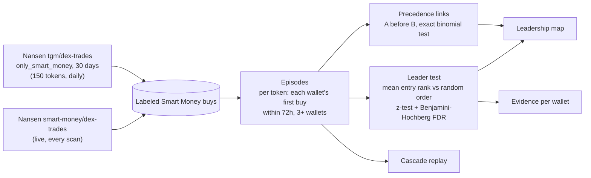
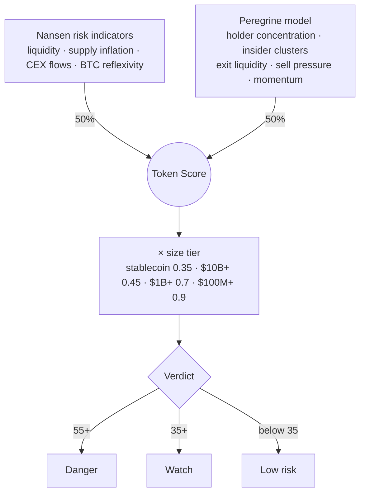
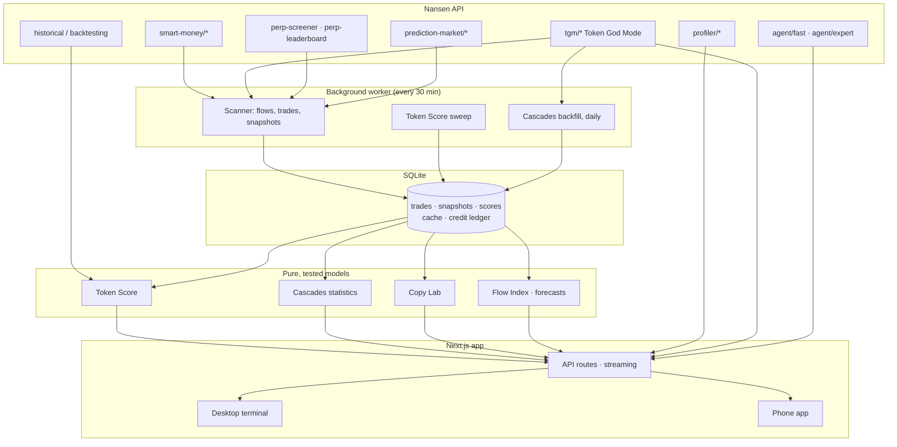

<div align="center">


# Peregrine

**A Smart Money terminal that runs entirely on the Nansen API.**<br/>
It reads Nansen's labeled onchain data, runs its own tested models on it, and shows every answer with the evidence behind it, on desktop and as a phone app.

</div>

> [!IMPORTANT]
> **Buildathon submission snapshot: [`submission-2026-09-27`](https://github.com/ghostCODERWEB/peregrine-multichain/releases/tag/submission-2026-09-27)**<br/>
> This README shows the current app, including UI fixes made after the deadline. The tag above is the frozen submission reviewers should judge. Every usage number and test result below is from the submission.

<div align="center">

[](https://peregrine-nansen.up.railway.app)
[](https://github.com/ghostCODERWEB/peregrine-multichain/releases/tag/submission-2026-09-27)
[](#proof)
[-00FFA7?style=flat-square&labelColor=0d1114)](#how-much-of-the-nansen-api-it-uses)
[](https://nansen.ai/api)

[**Live demo**](https://peregrine-nansen.up.railway.app) · [Proof page](https://peregrine-nansen.up.railway.app/proof) · [Cascades](https://peregrine-nansen.up.railway.app/cascade) · [60-second film](video-production/output/project-showcase-final.mp4)

</div>


Peregrine started as a list of things I would love Nansen to do next. It opens with **six features Nansen does not have yet**, then the **upgrades** it adds to pages Nansen already has, then the **proof** that it is real, tested and built on Nansen.

## Contents

- **New in Peregrine:** [Copy Lab](#1-copy-lab) · [Ask about anything on screen](#2-ask-about-anything-on-screen) · [Cascades](#3-cascades) · [Flow Index](#4-flow-index) · [Token Verdict](#5-token-verdict) · [Section rail](#6-section-rail)
- **Upgrades:** [Holders and insider clusters](#holders-and-insider-clusters) · [Perps](#perps) · [Alpha](#alpha) · [Prediction markets, sectors, chain pages, Profiler](#more-pages) · [Smart Money timeline](#smart-money-timeline) · [Research Desk](#research-desk)
- **The phone app:** [Liquid Glass, collapsing titles, section rail](#the-phone-app)
- **Proof:** [Usage and tested models](#proof) · [API coverage](#how-much-of-the-nansen-api-it-uses) · [Under the hood](#under-the-hood) · [Run it yourself](#run-it-yourself)

---

## Six features Nansen doesn't have yet

### 1. Copy Lab


A PnL leaderboard tells you who made money, not whether you could have made it by following them. Copy Lab ranks **Smart Money spot traders, Hyperliquid perp traders and Polymarket winners on one board**, each with a **copy score** from 0 to 100:

- **Up** when profit repeats across 7, 30 and 90 days, has actually been taken, and comes from many tokens or markets.
- **Down** for one lucky trade, bots that trade dozens of times a day, and heavy leverage (`src/lib/models/copy-score.ts`).

Every row shows what the trader holds right now. **If you see the trade late** replays Smart Money buys on 15-minute candles to show how much edge is left if you notice 15 minutes, 1 hour or 6 hours later. Tabs: All, Spot, Perps, Predictions, and KOLs and cohorts.

### 2. Ask about anything on screen

<table><tr>
<td width="72%" valign="top"></td>
<td valign="top"></td>
</tr><tr>
<td><sub><b>Desktop (⌘J):</b> click any chart, token or card. Each becomes a chip in your question, and the answer quotes the exact numbers it used.</sub></td>
<td><sub><b>Phone:</b> Ask grows out of the tab bar and already knows which page you are on.</sub></td>
</tr></table>

No copying numbers into a text box: point at things. It runs on Nansen's agent API (`agent/fast`, `agent/expert`).

### 3. Cascades


Some Smart Money wallets keep buying first, and others keep following them. Cascades find the leaders, then test whether it is real or luck:

1. **Episodes.** For each token, every Smart Money wallet's first buy (≥ $500) within a 72-hour window, with at least 3 wallets.
2. **Leaders.** Each wallet's average place in the queue is z-tested against random order, then corrected for testing hundreds of wallets at once (10% false-discovery rate).
3. **Pairs.** An exact binomial test for wallets that reliably buy before one another.

The recording (27 September 2026) shows the page being honest: 204 episodes and 304 wallets tested, and **no leader survives the correction**. It says so plainly rather than showing a list that is always full. The result moves as the 30-day window rolls. The **replay** plays one token's Smart Money buyers in the order they entered, and how many hours ahead each was.

<details>
<summary><b>How Cascades work, and their limits</b></summary>



Entry rank is scaled from 0 (first) to 1 (last); under random order a wallet's mean rank is 0.5. Entries within a minute count as ties. **Limits:** entering first is not causation (two wallets can share a source); pair links are not corrected for multiple testing; the backfill is capped at 1,000 trades per token; labels change over time.

</details>

### 4. Flow Index


$10M of Smart Money inflow means nothing on Ethereum and a lot on a small chain. The Flow Index scores **each chain against its own recent history**, from 0 to 100: above 65 Smart Money is accumulating more than usual, below 35 it is leaving. Its inputs are net flow and volume, scored robustly so one whale cannot throw it off.

The Overview sums it up in one sentence (*Buying Ton. Selling Near.*) over a live net-flow ring. **Chain flows** puts every chain on one screen, and Peregrine forecasts each chain's next reading.


### 5. Token Verdict

<table><tr>
<td width="50%" valign="top"></td>
<td width="50%" valign="top"></td>
</tr></table>

Every token gets a 0 to 100 score: **half Nansen's own risk indicators, half Peregrine's model** (holder concentration, linked insider wallets, exit liquidity, sell pressure). On top sits a **one-line verdict with up to four reasons, each backed by a number**, a read from Nansen's agent, and **7-day odds** of a 50% dump and a 30% breakout from two fitted models. On a week the models never saw, both scored **AUC 0.84**. Search works across **25 networks**.

<details>
<summary><b>How the score is built</b></summary>



The size tier scales established assets down (stablecoins, $10B+ caps, wrapped majors like WETH and WBTC), so a blue chip can't read Danger from onchain patterns alone. Sources: `src/lib/models/storm-score.ts`, `src/server/token/forecast.ts`. **Risk Radar** on the Overview flags Smart Money buying into tokens that score 50 or more.

</details>

### 6. Section rail

<table><tr>
<td width="72%" valign="top"></td>
<td valign="top"></td>
</tr></table>

Every page has a thin rail on the right edge, one tick per section. **Hover or drag it** and a label shows which section you will land on (*8/12 · 4 of the top 25 holders sit in insider clusters*), so long pages never feel long.

---

## Upgrades to pages Nansen already has

### Holders and insider clusters


The top holders float in 3D and turn under your pointer. Wallets that share a first funder, a relation or a deployer are grouped into **insider clusters**, with the share of supply each cluster holds.

### Perps


Hyperliquid through Nansen: open interest, funding extremes, the Smart Money book and a **liquidation radar you can filter to Smart Money only**. Every coin gets a pressure score built like the Flow Index, and its own page with positioning history.

### Alpha


The first tokens Smart Money has started buying, sorted by how much went in. One click opens the token and its Verdict, one more the wallet that bought it. The page also has a market map of tokens by Smart Money flow and price.

### More pages

<table><tr>
<td width="50%"><br/><sub><b>Prediction markets.</b> Polymarket through Nansen, sorted by what is moving, with full market pages. The best prediction traders also appear in Copy Lab.</sub></td>
<td width="50%"><br/><sub><b>Sectors.</b> Which themes Smart Money is moving into and out of, and how that changed over the last week.</sub></td>
</tr><tr>
<td><br/><sub><b>Chain pages.</b> Every chain with its Flow Index, activity and a heatmap of its busiest tokens.</sub></td>
<td><br/><sub><b>Profiler.</b> Any wallet or ENS name: one trader score across spot, perps and prediction markets, holdings, PnL, counterparties and first funder.</sub></td>
</tr></table>

### Smart Money timeline

Every large Smart Money move of the day in one feed, spot and perps together, filterable by kind, on the Smart Money desk next to the conviction map, crowded exits, the PnL leaderboard and the wallet network. The desk uses Smart Money labels, so it shows only on an owner instance (Nansen's redistribution rules).

### Research Desk

Name a token, wallet or ENS name and pick a mode (token due diligence, wallet investigation, who is leading this token, market brief). A live plan gathers **numbered evidence** from the Token Score, Smart Money flow, Cascades and Copy Lab, then Nansen's agent writes a report **from that evidence only**, with citations you can tap.

---

## The phone app

The phone version is its own app, not a squeezed desktop.

<table><tr>
<td width="33%" valign="top"><br/><sub><b>Liquid Glass tab bar.</b> The lens glides to the active tab as screens change.</sub></td>
<td width="33%" valign="top"><br/><sub><b>Large titles.</b> They collapse as you scroll, and content slides under the glass.</sub></td>
<td width="33%" valign="top"><br/><sub><b>Genie Ask.</b> The Ask panel grows out of the tab bar and folds back into it.</sub></td>
</tr></table>

<table><tr>
<td></td>
<td></td>
<td></td>
<td></td>
<td></td>
</tr></table>

Today, Tokens, Copy and Wallets tabs, plus Ask and Search; swipeable card rails; long panels open as previews with one tap to expand, while price charts and scorecards always show in full.

---

## Proof

Every number in this section is from the submission (the Proof page ledger, 22 to 26 September 2026). `docs/readme/data/` holds the exact exports, and `scripts/readme-assets/` redraws every chart from them.


A background worker reads Nansen every 30 minutes and stores what it finds, so most page views cost no credits: **12,888** requests (**62%** of all data requests in the ledger window) were answered from the cache.


| Model | Test | Result at submission |
|---|---|---|
| Dump odds (fitted model) | ≥ 50% drawdown within 7 days | **AUC 0.84** (the Token Score's hand-set weights: 0.71) |
| Breakout odds (fitted model) | ≥ 30% run-up within 7 days | **AUC 0.84** (hand-set weights: 0.78) |
| Volatility cone | price inside the 80% band after 1 day | **83%** of 754 token-days (target 80%) |
| Flow projections | next Flow Index reading per chain | **5.9%** median error |

Models are trained on three earlier weeks (576 token-weeks) and tested on the week of 8 September 2026 (178 token-weeks) that they never saw, using Nansen point-in-time data. The dump test has only 8 events, so its AUC interval runs from 0.67 to 1.00; the Proof page states this too.

## How much of the Nansen API it uses


Peregrine called **74 of the 80 documented Nansen endpoints (92.5%)**, plus 8 that are not in the published docs (account, Hyperliquid trading, points and social posts): **82 endpoints** in total. The 6 unused are Smart Alert management (3), trade execution and bridge status (2), and premium labels (1). The documented list is `docs/openapi.json` (merged from docs.nansen.ai); the calls are the Proof page ledger (`fixtures/proof-ledger.json`). Paths are compared after removing version prefixes (`v1`, `v1beta1`, `beta`).

<details>
<summary><b>Every endpoint and its call count</b> (88 rows)</summary>

| Family | Endpoint | Calls |
|---|---|--:|
| tgm | `tgm/flow-intelligence` | 574 |
| tgm | `tgm/token-ohlcv` | 331 |
| tgm | `tgm/who-bought-sold` | 268 |
| tgm | `tgm/transfers` | 180 |
| tgm | `tgm/perp-positions` | 162 |
| tgm | `tgm/holders` | 141 |
| tgm | `tgm/token-information` | 103 |
| tgm | `tgm/dex-trades` | 97 |
| tgm | `tgm/flows` | 95 |
| tgm | `tgm/indicators` | 91 |
| tgm | `tgm/pnl-leaderboard` | 56 |
| tgm | `tgm/position-intelligence` | 55 |
| tgm | `tgm/perp-trades` | 31 |
| tgm | `tgm/jup-dca` | 25 |
| tgm | `tgm/historical-token-flow-summary` | 11 |
| tgm | `tgm/historical-top-holders` | 11 |
| tgm | `tgm/historical-who-bought-sold` | 11 |
| tgm | `tgm/perp-pnl-leaderboard` | 9 |
| tgm | `tgm/historical-token-ohlcv` | 7 |
| tgm | `tgm/historical-token-quant-scores` | 7 |
| tgm | `tgm/historical-dex-trades` | 5 |
| tgm | `tgm/historical-pnl-leaderboard` | 5 |
| token-screener | `token-screener` | 1,860 |
| token-screener | `token-screener/historical` | 49 |
| profiler | `profiler/address/related-wallets` | 770 |
| profiler | `profiler/address/first-funder` | 405 |
| profiler | `profiler/address/current-balance` | 243 |
| profiler | `profiler/address/pnl-summary` | 82 |
| profiler | `profiler/address/transactions` | 74 |
| profiler | `profiler/perp-pnl-summary` | 43 |
| profiler | `profiler/perp-positions` | 43 |
| profiler | `profiler/address/counterparties` | 42 |
| profiler | `profiler/address/counterparties/batch` | 17 |
| profiler | `profiler/address/labels` | 16 |
| profiler | `profiler/perp-trades` | 14 |
| profiler | `profiler/address/pnl` | 12 |
| profiler | `profiler/address/historical-balances` | 9 |
| profiler | `profiler/address/historical-token-balances` | 8 |
| profiler | `profiler/address/historical-transactions` | 7 |
| profiler | `profiler/historical-transaction-lookup` | 2 |
| profiler | `profiler/dex-trades` | 1 |
| profiler | `profiler/address/premium-labels` | not used |
| prediction-market | `prediction-market/ohlcv` | 217 |
| prediction-market | `prediction-market/trades-by-market` | 133 |
| prediction-market | `prediction-market/address-summary` | 106 |
| prediction-market | `prediction-market/top-holders` | 53 |
| prediction-market | `prediction-market/categories` | 51 |
| prediction-market | `prediction-market/market-screener` | 48 |
| prediction-market | `prediction-market/event-screener` | 44 |
| prediction-market | `prediction-market/orderbook` | 41 |
| prediction-market | `prediction-market/pnl-by-market` | 21 |
| prediction-market | `prediction-market/pnl-by-address` | 20 |
| prediction-market | `prediction-market/trades-by-address` | 20 |
| prediction-market | `prediction-market/position-detail` | 7 |
| smart-money | `smart-money/dex-trades` | 129 |
| smart-money | `smart-money/perp-trades` | 46 |
| smart-money | `smart-money/netflow` | 31 |
| smart-money | `smart-money/holdings` | 21 |
| smart-money | `smart-money/dcas` | 19 |
| smart-money | `smart-money/pnl-leaderboard` | 16 |
| smart-money | `smart-money/historical-holdings` | 5 |
| smart-money | `smart-money/historical-token-balances` | 3 |
| search | `search/general` | 242 |
| search | `search/entity-name` | 5 |
| search | `search/token-sectors` | 4 |
| perp-screener | `perp-screener` | 75 |
| agent | `agent/fast` | 40 |
| agent | `agent/expert` | 2 |
| chains | `chains/chain-rank` | 30 |
| perp-leaderboard | `perp-leaderboard` | 27 |
| smart-alert | `smart-alert/list` | 10 |
| smart-alert | `smart-alert` | not used |
| smart-alert | `smart-alert/toggle` | not used |
| smart-alert | `smart-alert/{alert_id}` | not used |
| trade | `trade/quote` | 5 |
| trade | `trade/prepare` | 1 |
| trade | `trade/bridge-status` | not used |
| trade | `trade/execute` | not used |
| portfolio | `portfolio/defi-holdings` | 1 |
| transaction-with-token-transfer-lookup | `transaction-with-token-transfer-lookup` | 1 |
| beyond the docs | `account` | 375 |
| beyond the docs | `ra-agent/posts-by-token` | 61 |
| beyond the docs | `points/leaderboard` | 15 |
| beyond the docs | `points/tier` | 2 |
| beyond the docs | `perp/builder-fee` | 1 |
| beyond the docs | `perp/meta` | 1 |
| beyond the docs | `perp/order` | 1 |
| beyond the docs | `ra-agent/posts-by-user` | 1 |

Generated by `python3 scripts/readme-assets/endpoint-table.py`.
</details>


## Under the hood



- **Stored, not re-fetched.** Pages read from storage, so history builds up over time and a page view costs no credits.
- **Models are pure functions** with unit tests (`src/lib/models/*`): the Token Score, Cascades statistics, Copy Lab, flow indices and forecasts. At submission, `pnpm test` ran **667** unit and integration tests.
- **Every number has its source.** Charts carry an info popover listing the Nansen calls behind them, and research results cite their evidence.
- **One path to Nansen.** Every call goes through `callNansen` (`src/server/nansen/client.ts`): per-endpoint cache TTLs, stale-while-refresh, a per-visitor daily credit cap, rate-limit buckets, retry on 429, schema validation and a ledger row per call.
- **Stack:** Next.js 15, React 19, Tailwind v4, ECharts, SQLite (better-sqlite3), Vitest, Playwright, viem (for ENS).

<details>
<summary><b>The request path for every Nansen call</b></summary>


</details>

## Data sources and captures

- **Nansen** is the data source for every analytic, score and model in Peregrine.
- **Other sources, not used for analytics:** token and protocol logos (DexScreener, Jupiter, CoinGecko, CoinCap, Financial Modeling Prep, DefiLlama icons); ENS name resolution (public Ethereum RPCs and ensideas); and, in perps wallet research, Hyperliquid's public info API for full fill history and candles, next to Nansen's positions. `pnpm assert-nansen-only` lists every such host.
- **Owner-only views.** Copy Lab, Cascades and the Smart Money desk use Smart Money labels, so Nansen's redistribution rules keep them to an owner instance; public visitors see what each view shows instead.
- **Recorded from the live app on 27 September 2026** (owner view, frozen browser clock, network waits cut out): the Copy Lab, Ask (desktop and phone), Cascades, Perps, Alpha and Token Checker GIFs. The Predictions still is from the submission's own screenshots, also taken that day.
- **Captured from the current app** in demo mode (recorded Nansen data, clock set to 27 September 2026) with `pnpm screenshots`: the Overview, token chart, holders, section rail and phone GIFs, and the other stills. Desktop captures are cropped to the page area.

## Run it yourself

```bash
pnpm install
cp .env.example .env.local        # add NANSEN_API_KEY
pnpm dev                          # web app on http://localhost:3000
pnpm worker                       # background scanner, in a second terminal
pnpm tsx scripts/cascade-backfill.ts   # optional: fill 30 days of Cascades history now
pnpm test                         # unit and integration tests
pnpm e2e                          # Playwright end-to-end tests, desktop and phone
pnpm dev:demo                     # demo mode on :3300 from recorded Nansen responses, no key needed
```

**Redraw every figure in this README:**

```bash
pnpm tsx scripts/readme-assets/export-data.ts   # ledger, backtest, coverage, chains → docs/readme/data/
python3 scripts/readme-assets/charts.py         # → docs/readme/charts/ (needs matplotlib)
python3 scripts/readme-assets/endpoint-table.py # the endpoint table above
pnpm screenshots                                # stills and GIFs from a demo server on :3300 (needs Pillow)
```

**Deploy:** the included `Dockerfile` runs the web app and the worker in one container, with SQLite on a volume at `/data`. The live demo runs this way on Railway.

### Demo in 60 seconds

1. **Copy Lab:** who is worth following, in spot, perps and predictions, and what they hold now.
2. **Ask (⌘J):** select a chart and a token, ask which matters most.
3. **Cascades:** did proven early wallets lead the buying? Replay who entered first.
4. **Overview:** where Smart Money is moving, chain by chain, against each chain's own history.
5. **Token page:** the Verdict, both halves of the score and the 7-day odds.

---

<div align="center">

<a href="https://nansen.ai"></a>

Built for the **Nansen Meridian Buildathon** on the [Nansen API](https://nansen.ai/api) · Frozen submission: [`submission-2026-09-27`](https://github.com/ghostCODERWEB/peregrine-multichain/releases/tag/submission-2026-09-27)

</div>
