<div align="center">


# Peregrine

**An onchain intelligence terminal built on the Nansen API**

Built for the **Nansen Meridian Buildathon** (September 2026)

[Live demo](https://peregrine-nansen.up.railway.app) · [Proof page](https://peregrine-nansen.up.railway.app/proof) · [Cascades](https://peregrine-nansen.up.railway.app/cascade)

</div>

---

Peregrine turns Nansen's labeled onchain data into answers a trader can act on. It stores Nansen data continuously, runs its own statistical models on top, and shows every result with the evidence behind it.

It answers four questions that are hard to answer with Nansen alone:

| Question | Peregrine feature |
|---|---|
| **Is this token about to dump?** | Token Score and Verdict: 50% Nansen risk indicators, 50% Peregrine's model |
| **Who moves Smart Money?** | Cascades: which labeled wallets enter tokens *before* other Smart Money, tested against chance |
| **Can I actually copy Smart Money?** | Copy Lab: what you earn when you see a Smart Money trade 15 minutes, 1 hour or 6 hours late |
| **What is the full story on this token or wallet?** | Research Desk: a research plan that gathers numbered evidence and writes a cited report |

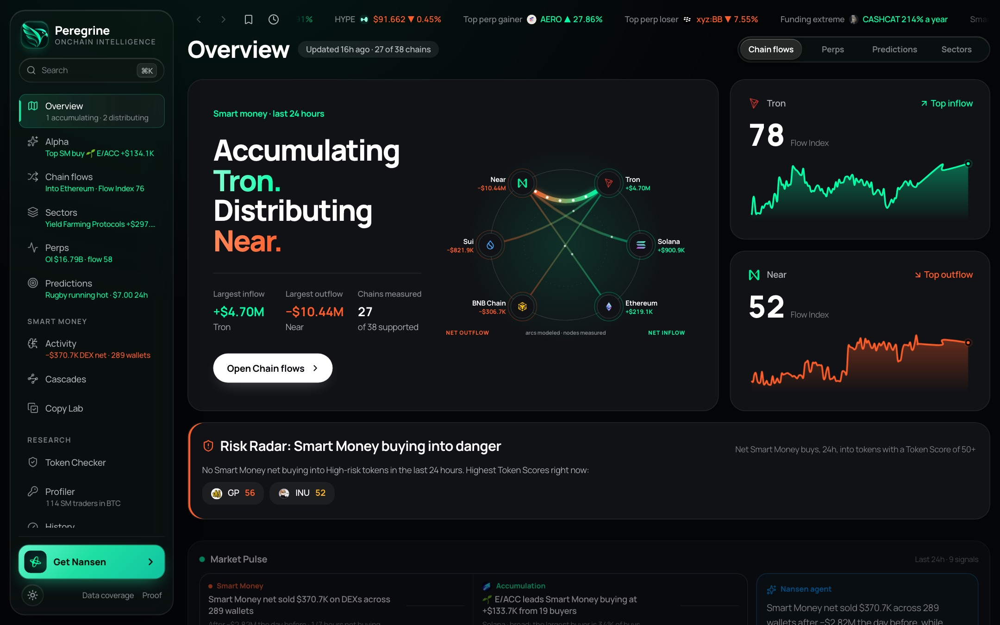

## Contents

- [Headline numbers](#headline-numbers)
- [Flagship: Smart Money Cascades](#flagship-smart-money-cascades)
- [Copy Lab](#copy-lab)
- [Token Score and Verdict](#token-score-and-verdict)
- [Research Desk](#research-desk)
- [Markets](#markets)
- [Profiler](#profiler)
- [Phone app](#phone-app)
- [Proof](#proof)
- [Architecture](#architecture)
- [Nansen endpoints used](#nansen-endpoints-used)
- [Run it yourself](#run-it-yourself)

## Headline numbers

| | |
|---|---|
| **7,903** real Nansen API calls during the buildathon (7.9× the 1,000 required) | **82** Nansen endpoints across 19 API families |
| **12,888** more requests served from cache | **0.84 AUC** for the dump-risk model on weeks it never saw |
| **25** networks in one token search, plus ENS names | **647** automated tests |

Every number above is shown live on the [Proof page](https://peregrine-nansen.up.railway.app/proof).

---

## Flagship: Smart Money Cascades

> **Which labeled Smart Money wallets consistently buy tokens *before* other Smart Money wallets, and who follows whom?**

Every tool treats Smart Money wallets as independent actors. None of the products reviewed (Nansen, Arkham, Bubblemaps, Dune dashboards, ChainfiAI) measures the *order* in which Smart Money wallets enter the same token and tests it against chance. Nansen's Smart Money trade feed only covers the last 24 hours, so this was previously an export-to-Python job.

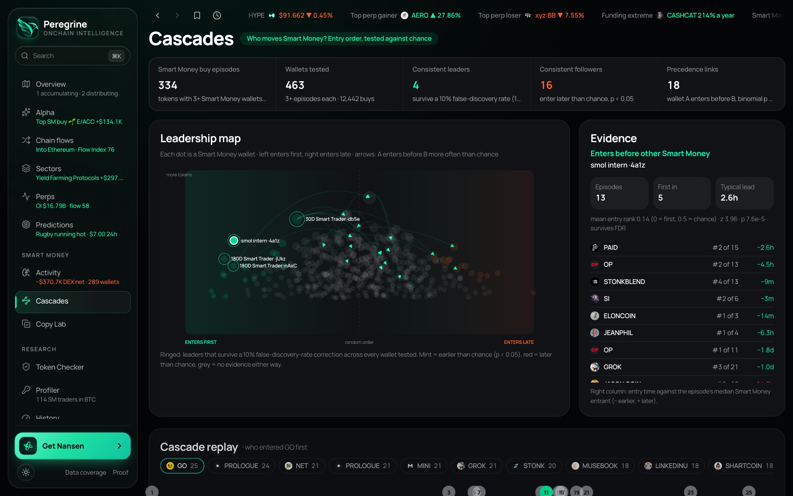

**How it works**

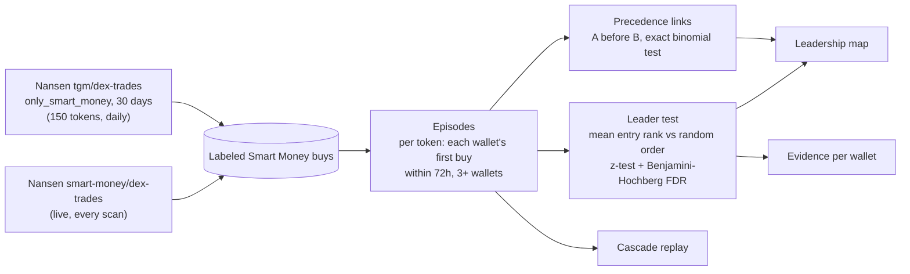

1. **Episodes.** For each token, every Smart Money wallet's first buy (≥ $500) within a 72-hour window. A new episode starts after the window closes. Each episode needs at least 3 wallets.
2. **Leaders.** Entry rank is scaled from 0 (first) to 1 (last). If entry order were random, a wallet's mean rank would be 0.5. Each wallet with 3+ episodes gets a z-test, and the results are corrected for testing hundreds of wallets at once (10% false-discovery rate).
3. **Precedence links.** For each pair of wallets that entered 3+ tokens together, an exact binomial test on how often each went first. Entries within a minute count as ties.

**Current result (30 days of data):** 12,443 Smart Money buys → 334 episodes → 463 wallets tested → **4 leaders survive the correction**, 16 consistent followers and 18 "enters before" links. For example, one leader typically enters 2.6 hours before the median Smart Money buyer across 13 episodes (p = 0.00008).

**Evidence.** Click any wallet to see each token, its rank of k, and how far ahead or behind the median entrant it was. The replay shows one token's Smart Money buyers in the order they entered. Wallet pages show each wallet's cascade role.

**Limits.** Entering first is not causation: two wallets can share a source. Pair links are not corrected for multiple testing. The backfill is capped at 1,000 trades per token, and labels change over time.

---

## Copy Lab

> **If you see a Smart Money trade late, is it still worth copying?**

Every stored Smart Money buy is replayed against Nansen's 15-minute price candles. Copy Lab measures the 24-hour return of entering at the same moment, 15 minutes late, 1 hour late and 6 hours late.

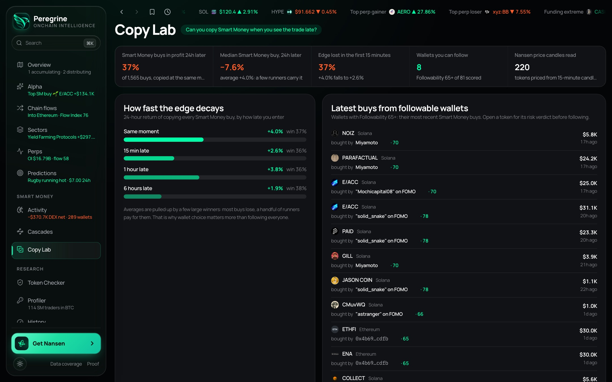

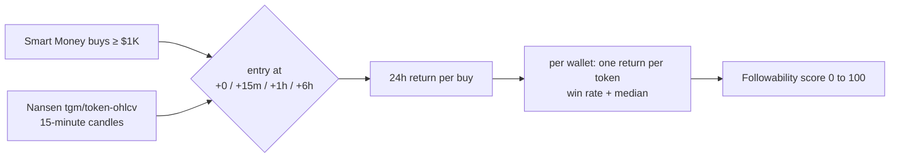

**What it found:** the median Smart Money buy is **down 7.6%** a day later, and only 37% of 1,565 buys were in profit. The +4.0% average is carried by a few big winners. About a third of the average edge is gone after just 15 minutes of delay, and only a handful of wallets stay profitable to copy an hour late.

Each wallet gets a **Followability** score from its win rate and median return when copied an hour late. It needs at least 3 tokens, and wallets with few tokens are pulled toward 50.

---

## Token Score and Verdict

> **Should I be worried about this token?**

Every token gets a 0 to 100 dump-risk score, **50% Nansen and 50% Peregrine**:

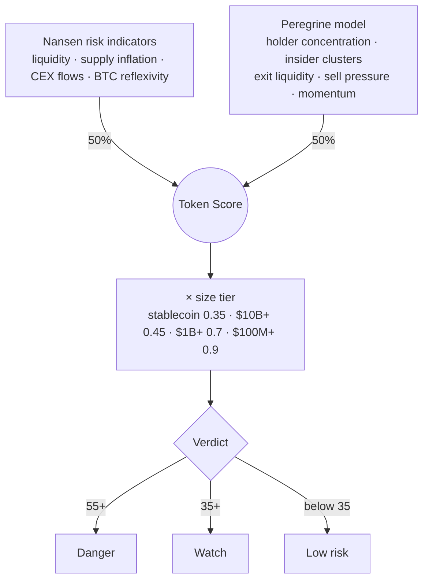

- **Nansen half:** Nansen's own low / medium / high risk levels, weighted by indicator.
- **Peregrine half:** a weighted mean of holder concentration, linked insider wallets, exit liquidity, sell pressure from top traders, and fresh-wallet buying against Smart Money selling.
- **Size tier:** established assets (stablecoins, $10B+ caps, wrapped majors like WETH and WBTC) are scaled down, so a blue chip can't read Danger from onchain patterns alone.

Each token page opens with a **Verdict card**: the level, both halves of the score, up to four reasons that each cite a number, and a one-sentence read from Nansen's agent.

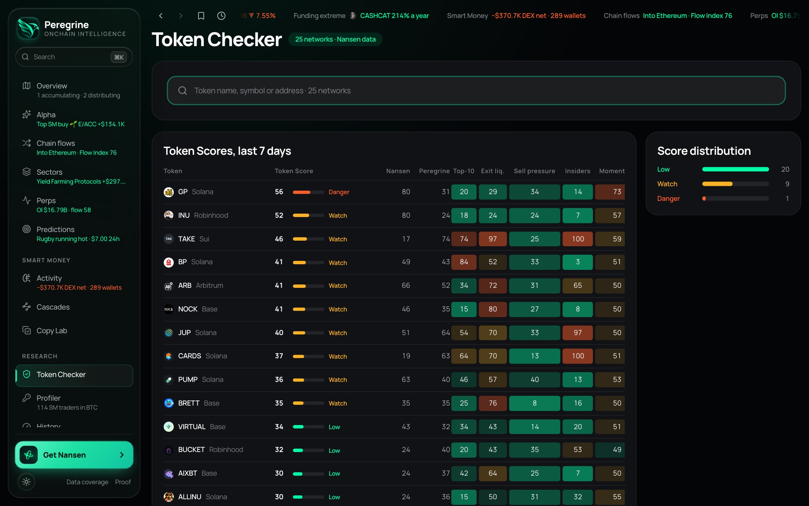

**Risk Radar** on the Overview flags **Smart Money buying into tokens that score 50 or more**, with a one-tap share to X. Shared token links preview a card with the verdict, the score dial and every sub-score.

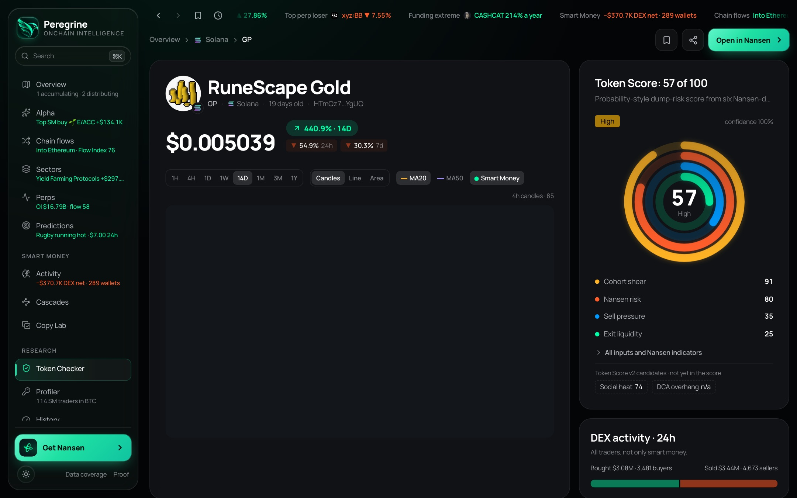

---

## Research Desk

> **Everything Peregrine knows about a token or wallet, in one cited report.**

Pick a research mode, name a target (symbol, contract address, wallet or ENS name), and watch it work:

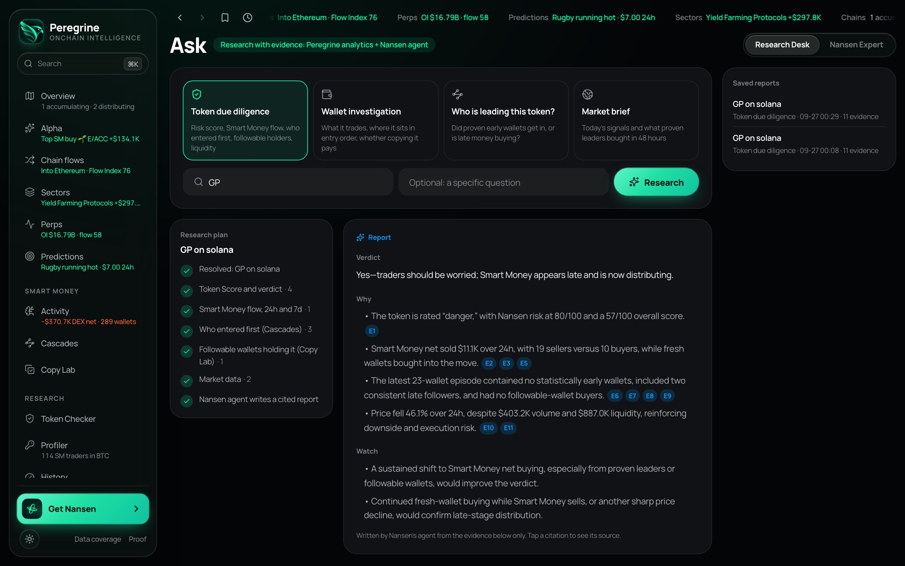


- **Four modes:** Token due diligence, Wallet investigation, Who is leading this token?, and Market brief.
- **A live plan:** every step shows as it runs, and each finding lands as a numbered evidence card with its source.
- **A cited report:** verdict, reasons and what to watch. Tap a citation to highlight its evidence.
- **Saved reports** can be reopened any time.
- **The quick Analyze panel** (⌘J on desktop, ✦ in the phone tab bar) answers questions about whatever is on screen.

---

## Markets

| Page | What it shows |
|---|---|
| **Overview** | Where Smart Money is accumulating and distributing across chains, Risk Radar, Market Pulse signals, Flow Index per chain and 24h projections |
| **Alpha** | Market map of tokens by Smart Money flow and price, alpha scores, early Smart Money buys |
| **Chain flows** | Net flow by chain, and capital rotating chain to chain by the same wallets |
| **Sectors** | Flows by sector and the tokens driving them |
| **Perps** | Hyperliquid open interest, funding extremes, the Smart Money book by coin, and a trading terminal per coin |
| **Predictions** | Polymarket through Nansen: category heat, repricing, category pages and full market pages |

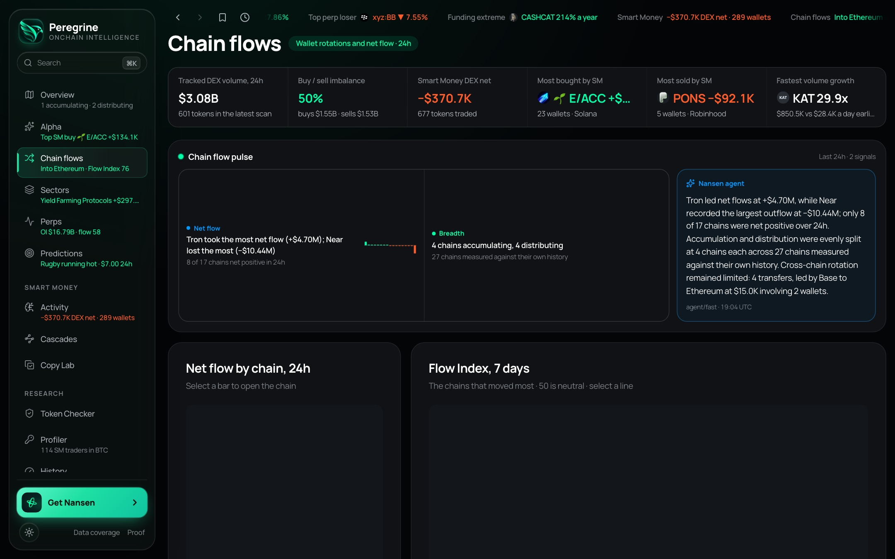

<table><tr>
<td>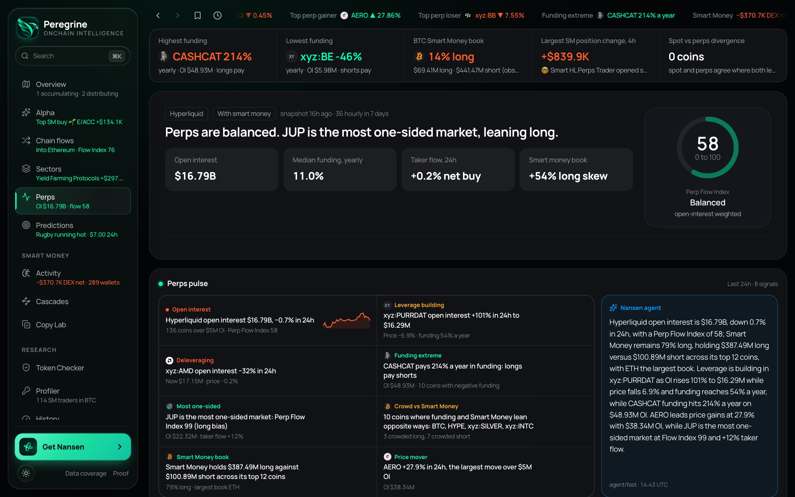</td>
<td>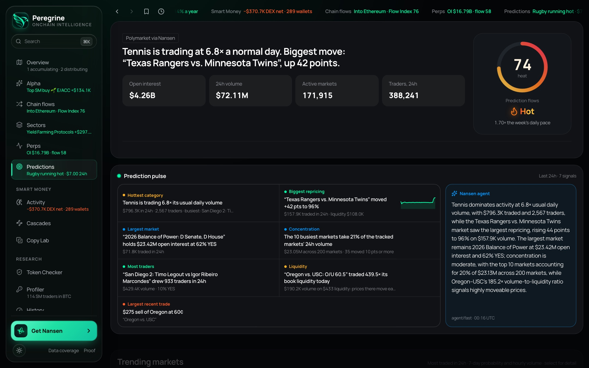</td>
</tr></table>

---

## Profiler

Any wallet, including ENS names like `vitalik.eth`, on one page. It shows:
- holdings by chain as a logo treemap,
- realized PnL, counterparties and first funder,
- recent transactions with spam filtered out,
- a point-in-time Time Machine and Hyperliquid positions,
- its **cascade role** and **Followability** score.

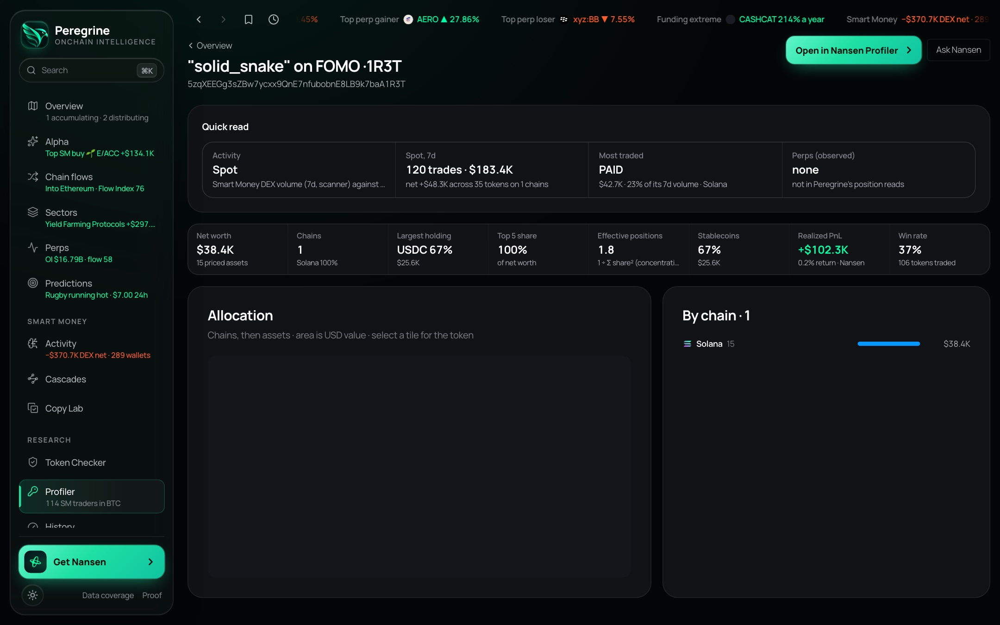

---

## Phone app

The phone version is built as its own app, not a shrunk desktop, following Apple's design guidance:
- **Liquid Glass tab bar:** Today, Tokens, Copy and Wallets, plus Ask and Search controls. It shrinks while you scroll.
- **iOS-style large titles and inset grouped lists.**
- **Swipeable card rails** and a fast-scroll section rail.
- **A quick Ask panel** that opens with a genie animation.

<table><tr>
<td>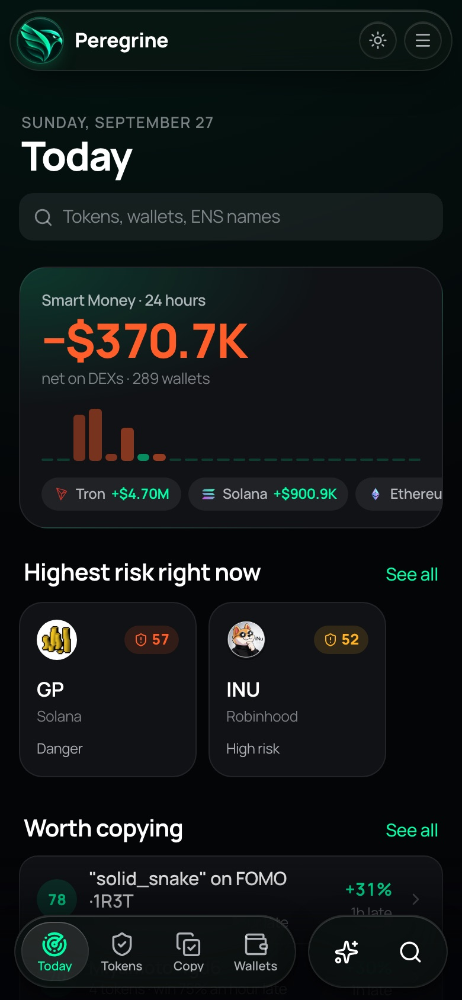</td>
<td>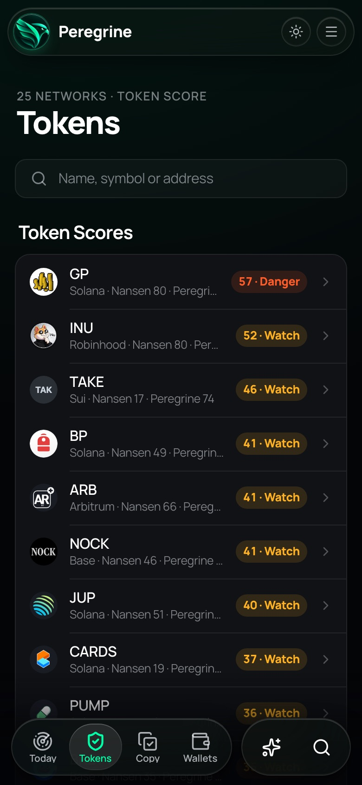</td>
<td>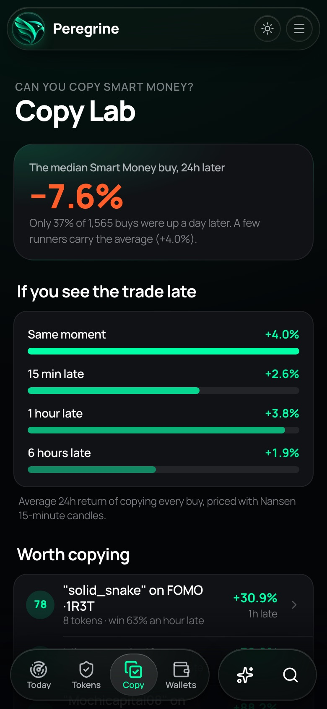</td>
</tr></table>

Tablets get the same screens in a two-column layout.

---

## Proof

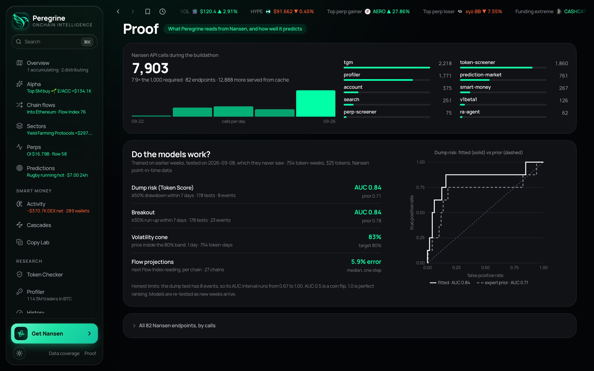

The Proof page shows how much Peregrine reads from Nansen and how well its models hold up:

| Model | Test | Result |
|---|---|---|
| Dump risk (Token Score) | ≥50% drawdown within 7 days | **AUC 0.84** (hand-set weights: 0.71) |
| Breakout | ≥30% run-up within 7 days | **AUC 0.84** (hand-set weights: 0.78) |
| Volatility cone | price inside the 80% band after 1 day | **83%** (target 80%) |
| Flow projections | next Flow Index reading per chain | **5.9%** median error |

Models are trained on earlier weeks and tested on a week they never saw, using Nansen point-in-time data. The dump test has only 8 events, so its AUC interval runs from 0.67 to 1.00. The page states this.

---

## Architecture

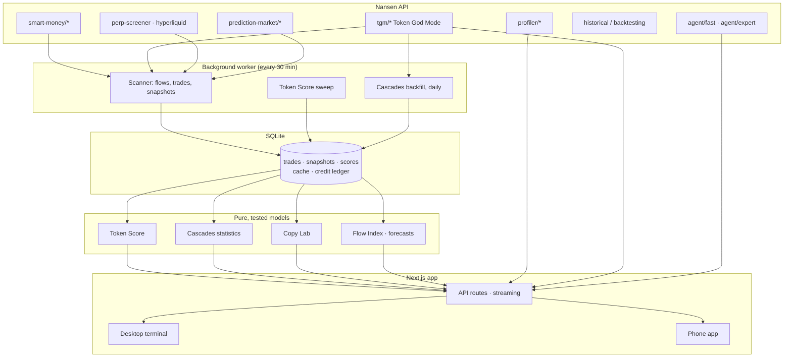

- **Stored, not re-fetched.** A background worker scans Nansen every 30 minutes and stores snapshots. Pages read from storage, so a page view costs no credits, and history builds up over time.
- **Models are pure functions** with unit tests (`src/lib/models/*`): the Token Score, Cascades statistics, Copy Lab, flow indices and forecasts.
- **Every number has its source.** Charts carry an info popover listing the Nansen calls behind them, and research results cite their evidence.
- **Caching and limits:** responses are cached per endpoint, repeat requests are deduplicated, concurrency is controlled, and a daily credit cap applies.
- **Stack:** Next.js 15, React 19, Tailwind v4, ECharts, SQLite (better-sqlite3), Vitest, Playwright, viem (for ENS).

## Nansen endpoints used

| Area | Endpoints | Used for |
|---|---|---|
| Smart Money | `smart-money/dex-trades`, `netflows`, `holdings`, `historical-holdings`, `perp-trades` | flows, Risk Radar, Cascades, Copy Lab, History |
| Token God Mode | `tgm/dex-trades` (only Smart Money, date range), `token-ohlcv`, `holders`, `flow-intelligence`, `who-bought-sold`, `indicators`, `token-information` | Token Score, Cascades backfill, Copy Lab prices, token pages |
| Profiler | `profiler/address/*` (balances, PnL, counterparties, related wallets, first funder, transactions, perp positions) | Profiler |
| Screeners | `token-screener`, `token-screener/historical`, `perp-screener` | Overview, Alpha, Sectors, backtests |
| Hyperliquid | perp screener, leaderboard, positions | Perps, Smart Money book |
| Prediction markets | `prediction-market/*` (categories, screeners, OHLCV, holders, trades) | Predictions |
| Agent | `agent/fast`, `agent/expert` | Research Desk reports, page briefs, Nansen Expert |

The full list of all 82 endpoints and their call counts is on the [Proof page](https://peregrine-nansen.up.railway.app/proof).

## Run it yourself

```bash
pnpm install
cp .env.example .env.local        # add NANSEN_API_KEY
pnpm dev                          # web app on http://localhost:3000
pnpm worker                       # background scanner, in a second terminal
pnpm tsx scripts/cascade-backfill.ts   # optional: fill 30 days of Cascades history now
pnpm test                         # 647 tests
```

**Deploy:** the included `Dockerfile` runs the web app and the worker in one container, with SQLite on a volume at `/data`. The live demo runs this way on Railway.

## Demo in 60 seconds

1. **Overview:** Risk Radar shows Smart Money buying into a Danger-scored token.
2. **Open the token:** the Verdict card shows Danger 56, both score halves and cited reasons.
3. **Cascades:** was that buying led by proven early wallets? Replay who entered first.
4. **Copy Lab:** could you have copied it? The median Smart Money buy is −7.6% a day later.
5. **Ask:** one cited report that puts it all together, then **Proof** for the numbers.

---

<div align="center">

Built for the **Nansen Meridian Buildathon** on the [Nansen API](https://nansen.ai/api)

</div>
